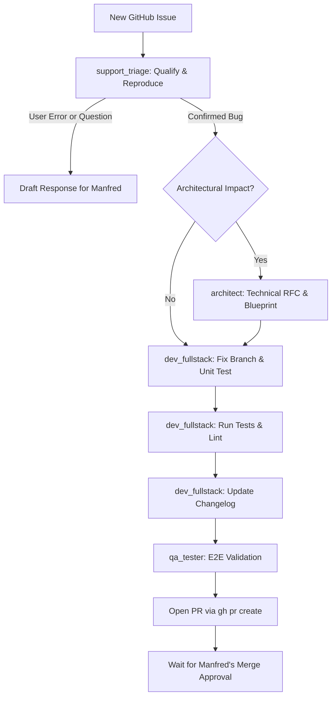

# 🛠️ Issue Resolution Workflow

This playbook details the end-to-end lifecycle for handling incoming user bug reports and GitHub issues.



---

## Step 1: Intake & Qualification (`support_triage`)
1. **Fetch Issue Data**:
   ```bash
   gh issue view <issue-number> --comments
   ```
2. **Examine Context**:
   - Extract WUD version, container runtime (Docker, Podman, Kubernetes, Nomad), OS architecture, and configuration snippet.
   - Cross-reference logs with matching source code in `app/`.
3. **Qualification Decision**:
   - **Scenario A: User Configuration Error or Usage Question**
     - Draft a polite, helpful explanation pointing to documentation and correct configuration syntax.
     - Present draft to Manfred. Do NOT post to GitHub without approval.
   - **Scenario B: Confirmed Bug**
     - Identify root cause file and line numbers.
     - Document minimal reproduction steps.
     - Proceed to Step 2 or 3.

---

## Step 2: Architectural Review (`architect`) — *Conditional*
- **Trigger**: The bug is caused by a fundamental protocol incompatibility, data storage limitation, or requires schema migration.
- **Action**: The architect defines a migration plan or interface refactoring before code changes are attempted.

---

## Step 3: Branch Creation & Implementation (`dev_fullstack`)
1. **Branch Preparation**:
   ```bash
   git checkout main && git pull origin main
   git checkout -b fix/<issue-number>_<short-description> origin/main
   ```
2. **Reproducing Test**:
   - Add a unit test in Jest (`app/**/*.test.ts`) that asserts the expected behavior and fails against the bug.
3. **Fix Implementation**:
   - Implement minimal, robust fix strictly addressing the root cause without side-effects.
   - Ensure Joi schemas are updated if configuration parsing was involved.
4. **Validation**:
   ```bash
   cd app && npm test
   cd app && npm run lint
   ```
5. **Changelog**:
   - Add line in `website/docs/changelog/next.md`:
     `- 🐛 [COMPONENT] Fix description (fixes #<issue-number>)`

---

## Step 4: Quality & E2E Validation (`qa_tester`)
1. If the fix touches container watchers, triggers, or external registries, verify against local E2E suite:
   ```bash
   LOCAL_MODE=true ./scripts/run-e2e-tests.sh
   ```
2. If the fix touches the frontend SPA (`ui/`):
   ```bash
   cd ui && npm run test:unit
   cd ui && npm run lint
   ```

---

## Step 5: Pull Request & User Approval
1. **Commit**:
   - Author: `Manfred Martin <16061231+fmartinou@users.noreply.github.com>`
   - Message: `🐛 [COMPONENT] Fix description (fixes #<issue-number>)`
2. **Push & PR**:
   ```bash
   git push -u origin fix/<issue-number>_<short-description>
   gh pr create --title "🐛 [COMPONENT] Fix description (fixes #<issue-number>)" --body "..."
   ```
3. **Report to Manfred**:
   - Provide PR URL, summary of root cause, test results, and CI status.
   - **NEVER merge into `main` without Manfred's explicit authorization.**
