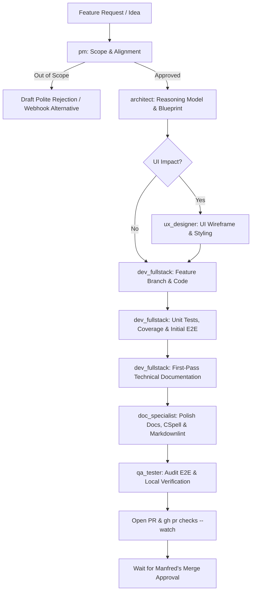

# 🚀 New Feature Development Workflow

This playbook details the structured process for introducing new features, watchers, registries, triggers, or UI capabilities into WUD.



---

## Step 1: Product Qualification (`pm`)
1. **Assess Core Alignment**:
   - Does this feature align with WUD's lightweight, autonomous container monitoring philosophy?
   - Can this feature be solved with existing generic triggers (e.g. Webhook, MQTT, Apprise)?
2. **Value vs Maintenance Burden**:
   - If maintenance is high and audience is niche: recommend alternative or reject politely.
   - If approved: define functional requirements and user expectations.

---

## Step 2: Architecture Blueprint (`architect`)
> [!IMPORTANT]
> The Architect **MUST** use an advanced reasoning model (e.g. Claude 3.5 Sonnet, Gemini Pro, GPT-4o, o3-mini; no Flash).

1. **Design Component Hierarchy & Backward Compatibility**:
   - Determine whether the feature is a new Watcher (`app/watchers/`), Registry (`app/registries/`), Trigger (`app/triggers/`), or Storage feature.
   - Extend base classes (`Watcher`, `Registry`, `Trigger`).
   - Guarantee backward compatibility for existing environment variables, Joi schemas, OpenAPI specs, and SQLite tables.
2. **Define Data Contracts & Joi Validation**:
   - Create explicit TypeScript interfaces.
   - Define strict Joi validation schemas for all newly introduced configuration options.
3. **Draft Implementation Plan**:
   - Produce a file-by-file roadmap, mock definitions, and test requirements for the developer.

---

## Step 3: UI & UX Specification (`ux_designer`) — *Conditional*
- **Trigger**: The feature introduces new views, buttons, topbar/footer changes, or dialogs.
- **Action**: Propose layout hierarchy, Vuetify components, and icon assignments before coding starts.

---

## Step 4: Fullstack Implementation (`dev_fullstack`)
1. **Branch Creation**:
   ```bash
   git checkout main && git pull origin main
   git checkout -b feat/<feature-name> origin/main
   ```
2. **Code Implementation**:
   - Implement according to the architect's blueprint.
   - Enforce strict typing with zero `any`.
   - Update component registration in `app/registry/index.ts`.
3. **Exhaustive Unit Tests & Coverage**:
   - Write comprehensive Jest tests covering nominal paths, error paths, and Joi validation edge cases.
   - Verify code coverage: `cd app && npm test` (ensure no coverage regression).
4. **Initial E2E Test**:
   - Add initial Gherkin feature and step definitions in `e2e/features/` or Playwright test in `ui-e2e/`.
5. **First-Pass Technical Documentation**:
   - Document new environment variables, types, defaults, and Compose snippets in `website/docs/configuration/...`.

---

## Step 5: Documentation Review & Quality Gates (`doc_specialist`)
1. **Review & Polish**:
   - Harmonize developer documentation with site style and navigation in `website/sidebars.ts`.
2. **Linting & Spell Checking**:
   - Run CSpell and Markdownlint:
     ```bash
     cd website && npm run lint:docs
     ```
   - Add genuine domain terms to `cspell.json`.
3. **Static Build Validation**:
   - Validate build with zero broken links:
     ```bash
     cd website && npm run build
     ```

---

## Step 6: Integration & E2E Audit (`qa_tester`)
1. **Audit E2E Tests**:
   - Challenge boundary conditions, simulate network failures/timeouts, and ensure tests are not flaky.
2. **Run E2E Suites**:
   - Backend: `LOCAL_MODE=true ./scripts/run-e2e-tests.sh`
   - Frontend: `./scripts/run-ui-tests.sh`

---

## Step 7: Pull Request & CI Gate
1. **Commit & Push**:
   - Author: User's configured Git author (never an AI/bot identity).
   - Message: `🚀 [COMPONENT] Short descriptive title (fixes #<issue-number>)`
   - Push: `git push -u origin feat/<feature-name>`
2. **Create PR**:
   ```bash
   gh pr create --title "🚀 [COMPONENT] Short descriptive title" --body "..."
   ```
3. **Mandatory CI Monitoring**:
   - Watch GitHub Actions pipeline until all checks are green:
     ```bash
     gh pr checks <pr-number> --watch
     ```
4. **Merge Authorization**:
   - Report PR status and test coverage to Manfred.
   - **Await Manfred's explicit approval before merging.**
