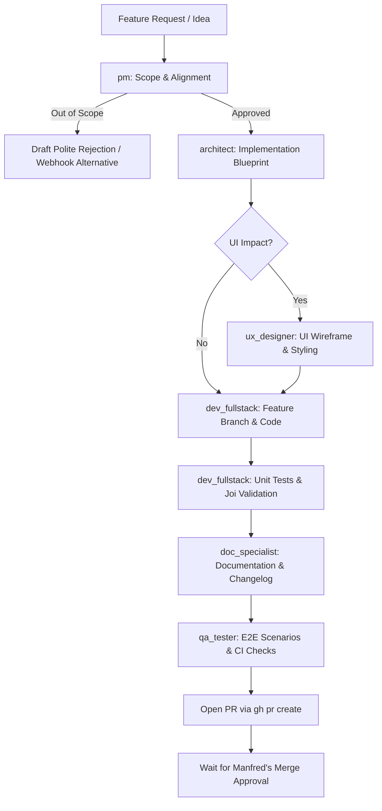

# 🚀 New Feature Development Workflow

This playbook details the structured process for introducing new features, watchers, registries, triggers, or UI capabilities into WUD.



---

## Step 1: Product Qualification (`pm`)
1. **Assess Core Alignment**:
   - Does this feature align with WUD's lightweight, autonomous container monitoring philosophy?
   - Can this feature be solved with existing generic triggers (e.g. Webhook, MQTT, Apprise)?
2. **Value vs Maintenance Burden**:
   - If maintenance is high and audience is niche: recommend alternative or reject politely.
   - If approved: define functional requirements and user expectations.

---

## Step 2: Architecture Blueprint (`architect`)
1. **Design Component Hierarchy**:
   - Determine whether the feature is a new Watcher (`app/watchers/`), Registry (`app/registries/`), Trigger (`app/triggers/`), or Storage feature.
   - Extend relevant base classes (`Watcher`, `Registry`, `Trigger`).
2. **Define Data Contracts & Joi Validation**:
   - Create explicit TypeScript interfaces.
   - Define strict Joi validation schemas for all newly introduced configuration options.
3. **Draft Implementation Plan**:
   - Produce a file-by-file roadmap and test requirements for the developer.

---

## Step 3: UI & UX Specification (`ux_designer`) — *Conditional*
- **Trigger**: The feature introduces new views, buttons, topbar/footer changes, or dialogs.
- **Action**: Propose layout hierarchy, Vuetify components, and icon assignments before coding starts.

---

## Step 4: Fullstack Implementation (`dev_fullstack`)
1. **Branch Creation**:
   ```bash
   git checkout main && git pull origin main
   git checkout -b feat/<feature-name> origin/main
   ```
2. **Code Implementation**:
   - Implement according to the architect's blueprint.
   - Enforce strict typing with zero `any`.
   - Update component registration in `app/registry/index.ts`.
3. **Unit Tests**:
   - Write comprehensive Jest tests covering success paths, error paths, and Joi validation edge cases.
   - Run: `cd app && npm test` and `npm run lint`.

---

## Step 5: Documentation & Changelog (`doc_specialist`)
1. **Documentation Portal (`website/docs/`)**:
   - Document new configuration variables, types, and defaults.
   - Add realistic `docker run` and `docker-compose.yml` examples.
   - Validate build: `cd website && npm run build`.
2. **Changelog**:
   - Add entry to `website/docs/changelog/next.md`:
     `- 🚀 [COMPONENT] Add support for feature XYZ (fixes #<issue-number>)`

---

## Step 6: Integration & E2E Testing (`qa_tester`)
1. **Backend Integration**:
   - Add or update Gherkin feature files in `e2e/features/`.
   - Verify with `cd e2e && npm run test:local`.
2. **Frontend UI Integration** (if applicable):
   - Add Playwright tests in `ui-e2e/tests/`.
   - Verify with `./scripts/run-ui-tests.sh`.

---

## Step 7: Pull Request & Merge Gate
1. **Commit**:
   - Author: `Manfred Martin <16061231+fmartinou@users.noreply.github.com>`
   - Message: `🚀 [COMPONENT] Short descriptive title (fixes #<issue-number>)`
2. **Create PR**:
   ```bash
   git push -u origin feat/<feature-name>
   gh pr create --title "🚀 [COMPONENT] Short descriptive title" --body "..."
   ```
3. **Merge Authorization**:
   - Report PR status and test coverage to Manfred.
   - **Await Manfred's explicit approval before merging.**
