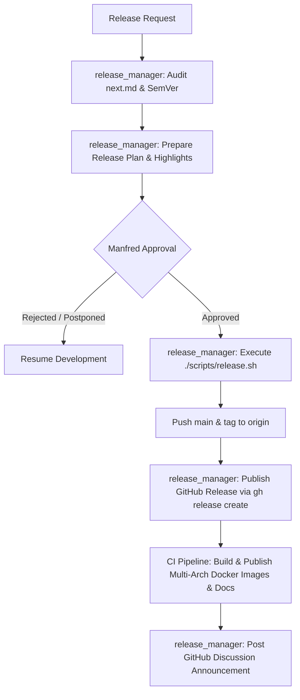

# 📦 Release & Deployment Workflow

This playbook guides the automated release preparation, versioning, Docusaurus snapshotting, artifact publication, and announcement process for WUD.



---

## Step 1: SemVer Audit (`release_manager`)
1. **Analyze Unreleased Changes**:
   - Inspect `website/docs/changelog/next.md`.
   - Identify entries with:
     - ⚠️ `Breaking / Deprecation` ➔ **Major release** (`X.0.0`)
     - 🚀 `Feature` / Enhancement ➔ **Minor release** (`x.Y.0`)
     - 🐛 `Bug Fix` / Maintenance ➔ **Patch release** (`x.y.Z`)
2. **Review Open PRs & Git Status**:
   - Ensure all intended PRs are squashed and merged into `main`.
   - Ensure local working directory is fully synchronized with `origin/main` (`git pull origin main`).

---

## Step 2: Release Plan Submission (`release_manager`)
Prepare a release overview containing:
- Target version (e.g. `9.0.0`).
- Summary of core highlights.
- Breaking changes and user migration guide (if any).
- Pre-flight checklist status (all CI checks passing on `main`).

Present this plan to Manfred and **wait for explicit authorization**.

---

## Step 3: Release Script Execution (`release_manager`)
Once authorized by Manfred:
```bash
./scripts/release.sh <version>
```
*Note: Do NOT prefix `<version>` with `v` (use e.g. `9.0.0`, NOT `v9.0.0`).*

The script automatically executes:
1. `npm version <version> --no-git-tag-version` across all subpackages (`root`, `app/`, `ui/`, `e2e/`, `website/`).
2. Migration of `website/docs/changelog/next.md` entries into `website/docs/changelog/<version>.md`.
3. Docusaurus version snapshotting (`npm run docusaurus docs:version <version>`).
4. Automated cleanup of `next.md` from the versioned docs directory.
5. Creation of the release commit and Git tag `<version>`.

---

## Step 4: Push Commit & Git Tag
```bash
git push origin main
git push origin <version>
```

---

## Step 5: Publish GitHub Release (`release_manager`)
**Mandatory step**: Pushing the Git tag does **not** create the GitHub Release. Publish the GitHub Release immediately so its publication timestamp reflects the real release time:
```bash
MAJOR=$(echo "<version>" | cut -d. -f1)
NOTES=$(sed -n '/## \['"<version>"'\]/,/---/p' "website/docs/changelog/v${MAJOR}.md" | sed '1d;$d')
gh release create "<version>" --title "<version>" --notes "$NOTES"
```
*Rule: NEVER prefix the tag or title with `v` (e.g. use `9.1.0`, never `v9.1.0`).*

---

## Step 6: CI Release Monitoring (`qa_tester` / `release_manager`)
1. Monitor the GitHub Actions CI workflow:
   ```bash
   gh run list --workflow=ci.yml
   ```
2. Verify that:
   - Multi-architecture Docker images (`linux/amd64`, `linux/arm64`) are built and pushed to Docker Hub and GHCR.
   - Documentation is built and deployed to GitHub Pages (`getwud.app`).

---

## Step 7: Post-Release Community Announcement (`release_manager`)
1. Post a celebratory release announcement in GitHub Discussions under the **Announcements** category on Manfred's behalf.
2. Highlight the major features, bug fixes, and link to documentation.
