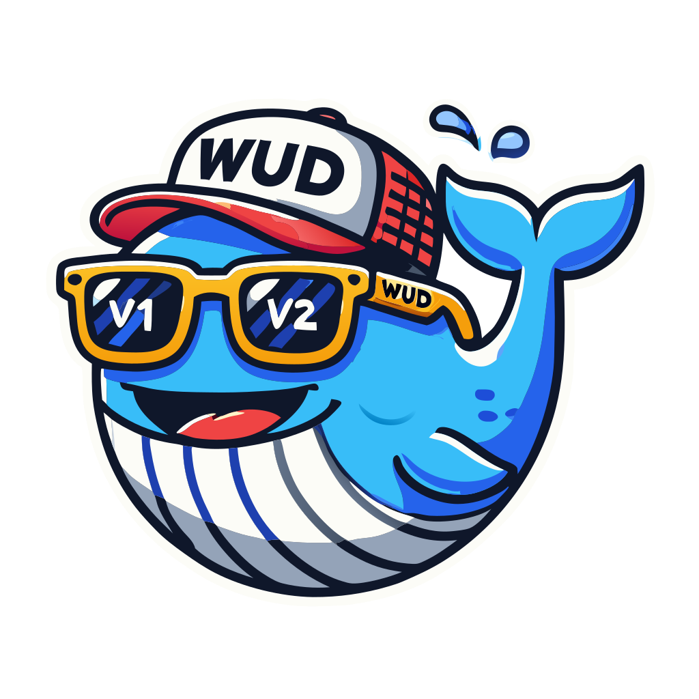
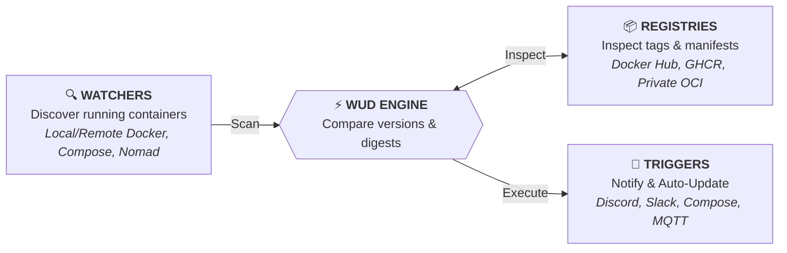

<div align="center">



# What's Up Docker? (WUD)

### *Keep your Docker containers up-to-date, automatically and effortlessly.*

[](https://hub.docker.com/r/getwud/wud)
[](https://github.com/getwud/wud/stargazers)
[](https://github.com/getwud/wud/actions/workflows/ci.yml)
[](https://github.com/getwud/wud/blob/main/LICENSE)
[](https://getwud.app/)
[](https://www.buymeacoffee.com/61rUNMm)
[](https://www.paypal.com/donate/?business=ZSDMEC3ZE8DQ8&no_recurring=0&currency_code=EUR)

<p align="center">
  <a href="https://getwud.app/"><b>📖 Documentation</b></a> •
  <a href="https://getwud.app/docs/quickstart/"><b>🚀 Quick Start</b></a> •
  <a href="https://getwud.app/docs/configuration/"><b>⚙️ Configuration</b></a> •
  <a href="https://getwud.app/docs/configuration/triggers/"><b>🔔 Triggers</b></a> •
  <a href="https://getwud.app/docs/configuration/registries/"><b>📦 Registries</b></a> •
  <a href="CONTRIBUTING.md"><b>🛠️ Contributing</b></a> •
  <a href="https://github.com/getwud/wud/issues"><b>💬 Issues & Support</b></a>
</p>

---

</div>

<p align="center">
  
</p>

## 💡 About WUD

**WUD (What's Up Docker?)** is a lightweight, proactive container update monitoring and automation tool. It continuously scans your container environments, detects image updates across public and private registries, performs semantic version analysis, and alerts you via your favorite notification channels—or triggers automatic container updates seamlessly.



---

## ✨ Features

- 🔍 **Multi-Watcher Engine**  
  Monitor local Docker daemons, remote Docker engines over TLS, Docker Compose setups, or HashiCorp Nomad workloads.
- 📦 **Multi-Registry Integration**  
  Zero-config & authenticated support for **Docker Hub**, **GitHub Container Registry (GHCR)**, **AWS ECR**, **Google GCR/GAR**, **Azure ACR**, **Quay**, **GitLab**, **Gitea**, **Forgejo**, **Codeberg**, **LinuxServer (LSCR)**, and any custom/self-hosted OCI registry.
- 🔔 **30+ Notification & Automation Triggers**  
  Discord, Matrix, Mattermost, Zulip, Telegram, Slack, Signal, WhatsApp, Bark, Prowl, Home Assistant, Gotify, Ntfy, Pushover, Apprise, Webhooks, Kafka, AMQP/RabbitMQ, NATS, Opsgenie, PagerDuty, Uptime Kuma, GitHub Actions, GitLab CI, SMTP email, shell scripts, and native Docker / Compose / Nomad auto-updaters.
- 🔄 **Automated Container Updates**  
  Automatically pull new images and recreate containers on demand (Docker, Docker Compose, Nomad).
- 🏷️ **SemVer & Tag Filtering**  
  Flexible versioning strategies: target `semver` (major, minor, patch), match custom regular expressions, pin versions, or define include/exclude tag rules.
- 🖥️ **Interactive Web UI & REST API**  
  Clean, responsive web dashboard to inspect container statuses, trigger manual update checks, and query data via a full-featured REST API.
- 📊 **Prometheus & Grafana Ready**  
  Built-in Prometheus `/metrics` endpoint and pre-built Grafana dashboards for observability.
- 🔒 **Enterprise-Grade Authentication & RBAC**  
  Role-Based Access Control (`admin`, `rw`, `ro`), database-backed user management, personal API tokens, and single sign-on with **OpenID Connect (OIDC)** (Keycloak, Authentik, Authelia, etc.) or local accounts.

---

## ⚡ Quick Start

### 1. Run with Docker

```bash
docker run -d \
  --name wud \
  -p 3000:3000 \
  -e WUD_AUTH_ADMIN_USER="admin" \
  -e WUD_AUTH_ADMIN_PASSWORD="MySecurePassword123" \
  -v /var/run/docker.sock:/var/run/docker.sock \
  getwud/wud:latest
```

### 2. Run with Docker Compose

```yaml
services:
  whatsupdocker:
    image: getwud/wud:latest
    container_name: wud
    ports:
      - "3000:3000"
    environment:
      - WUD_AUTH_ADMIN_USER=admin
      - WUD_AUTH_ADMIN_PASSWORD=MySecurePassword123
    volumes:
      - /var/run/docker.sock:/var/run/docker.sock
    restart: unless-stopped
```

> 🌐 **Access the Web UI**: Open [`http://localhost:3000`](http://localhost:3000) in your browser (login with `admin` / `MySecurePassword123`).

---

## 🧩 Supported Integrations

### 📦 Registries
| Registry | Description | Authentication |
| :--- | :--- | :---: |
| [**Docker Hub**](https://getwud.app/docs/configuration/registries/hub/) | Public and private Docker Hub images | Anonymous / Token / Password |
| [**GitHub (GHCR)**](https://getwud.app/docs/configuration/registries/ghcr/) | GitHub Container Registry packages | Personal Access Token |
| [**AWS ECR**](https://getwud.app/docs/configuration/registries/ecr/) | Amazon Elastic Container Registry | AWS IAM Keys / IAM Roles |
| [**Google GCR / Artifact Registry**](https://getwud.app/docs/configuration/registries/gcr/) | GCP Container & Artifact Registry | Service Account Key (JSON) |
| [**Azure ACR**](https://getwud.app/docs/configuration/registries/acr/) | Azure Container Registry | Service Principal / Admin Secret |
| [**GitLab Registry**](https://getwud.app/docs/configuration/registries/gitlab/) | GitLab Container Registry | Deploy Token / PAT |
| [**Quay.io**](https://getwud.app/docs/configuration/registries/quay/) | Red Hat Quay | Robot Account / OAuth Token |
| [**Self-Hosted / OCI**](https://getwud.app/docs/configuration/registries/custom/) | Harbor, Nexus, Artifactory, Gitea, Forgejo, Codeberg | Basic Auth / Bearer Token |

### 🔔 Triggers & Notifications
| Category | Supported Channels |
| :--- | :--- |
| **Chat & Messaging** | [Discord](https://getwud.app/docs/configuration/triggers/discord/), [Matrix](https://getwud.app/docs/configuration/triggers/matrix/), [Mattermost](https://getwud.app/docs/configuration/triggers/mattermost/), [Signal](https://getwud.app/docs/configuration/triggers/signal/), [Telegram](https://getwud.app/docs/configuration/triggers/telegram/), [Slack](https://getwud.app/docs/configuration/triggers/slack/), [Rocket.Chat](https://getwud.app/docs/configuration/triggers/rocketchat/), [WhatsApp](https://getwud.app/docs/configuration/triggers/whatsapp/), [Zulip](https://getwud.app/docs/configuration/triggers/zulip/) |
| **Push Notifications & Alerting** | [Bark](https://getwud.app/docs/configuration/triggers/bark/), [Gotify](https://getwud.app/docs/configuration/triggers/gotify/), [IFTTT](https://getwud.app/docs/configuration/triggers/ifttt/), [Ntfy](https://getwud.app/docs/configuration/triggers/ntfy/), [Opsgenie](https://getwud.app/docs/configuration/triggers/opsgenie/), [PagerDuty](https://getwud.app/docs/configuration/triggers/pagerduty/), [Prowl](https://getwud.app/docs/configuration/triggers/prowl/), [Pushover](https://getwud.app/docs/configuration/triggers/pushover/), [Apprise](https://getwud.app/docs/configuration/triggers/apprise/) |
| **Auto-Update & Orchestration** | [Docker Container](https://getwud.app/docs/configuration/triggers/docker/), [Docker Compose](https://getwud.app/docs/configuration/triggers/docker-compose/), [HashiCorp Nomad](https://getwud.app/docs/configuration/triggers/nomad/) |
| **IoT & Message Queues** | [AMQP (RabbitMQ)](https://getwud.app/docs/configuration/triggers/amqp/), [Apache Kafka](https://getwud.app/docs/configuration/triggers/kafka/), [MQTT (Home Assistant auto-discovery)](https://getwud.app/docs/configuration/triggers/mqtt/), [NATS](https://getwud.app/docs/configuration/triggers/nats/) |
| **Automation & Custom** | [GitHub Actions](https://getwud.app/docs/configuration/triggers/githubactions/), [GitLab CI](https://getwud.app/docs/configuration/triggers/gitlabci/), [Home Assistant (Webhook)](https://getwud.app/docs/configuration/triggers/homeassistant/), [HTTP Webhooks](https://getwud.app/docs/configuration/triggers/http/), [Shell Command Execution](https://getwud.app/docs/configuration/triggers/command/), [SMTP Email](https://getwud.app/docs/configuration/triggers/smtp/), [Uptime Kuma](https://getwud.app/docs/configuration/triggers/uptimekuma/) |

---

## 🏷️ Configuration via Docker Labels

WUD can be configured globally through environment variables or granularly per container using Docker labels:

```yaml
services:
  my-app:
    image: myorg/myapp:1.2.0
    labels:
      # Only consider semver minor and patch updates (e.g. 1.2.1, 1.3.0, but not 2.0.0)
      - "wud.tag.include=^1\\.\\d+\\.\\d+$"
      - "wud.tag.transform=^v(.*)$$ => $$1"
      
      # Send update notifications to a specific Discord webhook
      - "wud.trigger.discord.mywebhook.enabled=true"
      
      # Automatically recreate this container when an update is available
      - "wud.trigger.docker.myupdater.enabled=true"
```

Explore all configuration options in the [Configuration Hub](https://getwud.app/docs/configuration/).

---

## 📚 Documentation

For complete setup guides, advanced configurations, tutorials, and API references, check out our official documentation:

👉 **[https://getwud.app/](https://getwud.app/)**

- 🚀 [Getting Started & Tutorials](https://getwud.app/docs/quickstart/)
- ⚙️ [Configuration Reference](https://getwud.app/docs/configuration/)
- 🔍 [Docker Watcher & TLS](https://getwud.app/docs/configuration/watchers/)
- 📦 [Registry Authentication](https://getwud.app/docs/configuration/registries/)
- 🔔 [Triggers & Automation Setup](https://getwud.app/docs/configuration/triggers/)
- 📊 [Prometheus & Grafana Monitoring](https://getwud.app/docs/monitoring/)
- 🔌 [REST API Reference](https://getwud.app/docs/api/)
- ❓ [Frequently Asked Questions (FAQ)](https://getwud.app/docs/faq/)

---

## 🤝 Community & Support

- 🛠️ **Want to contribute?** Read our [Developer & Contributing Guide](CONTRIBUTING.md).
- 🐛 **Found a bug or need a feature?** Submit an [Issue](https://github.com/getwud/wud/issues).
- ⭐ **Like WUD?** Give us a star on [GitHub](https://github.com/getwud/wud)!
- ☕ **Support the maintainer:** [Buy me a coffee](https://www.buymeacoffee.com/61rUNMm) or [Donate via PayPal](https://www.paypal.com/donate/?business=ZSDMEC3ZE8DQ8&no_recurring=0&currency_code=EUR).

---

## 📄 License

This project is open-source software licensed under the [MIT License](https://github.com/getwud/wud/blob/main/LICENSE).