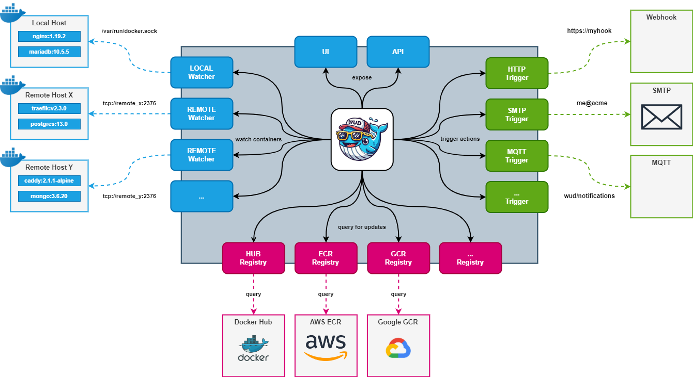
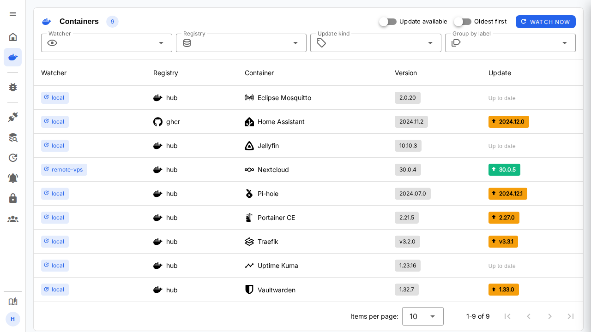

# Introduction

## WUD <small>(aka _**What's up Docker?**_)</small>

Keep your containers up to date!

#### Overview

- <i className="mdi mdi-update" /> **WATCHERS** scan Docker hosts to discover containers to monitor.
- <i className="mdi mdi-database-search" /> **REGISTRIES** query remote Docker registries to find candidate updates.
- <i className="mdi mdi-bell-ring" /> **TRIGGERS** execute actions when updates are available.

## Supported triggers

A wide range of triggers are supported:

- **Notifications**: Send alerts via email, mobile push notifications, chat services, and more.
- **Container updates**: Automatically update containers (Docker, Docker Compose, Nomad...).
- **Custom automation**: Trigger arbitrary actions via scripts, HTTP webhooks, message queues (MQTT, Kafka), and more.

:::info
[View the full list of supported triggers](configuration/triggers/)
:::

## Supported registries

Many container registries are supported out of the box:

- [**Azure Container Registry**](https://azure.microsoft.com/services/container-registry)
- [**AWS Elastic Container Registry**](https://aws.amazon.com/ecr)
- [**Google Container Registry**](https://cloud.google.com/container-registry)
- [**GitHub Container Registry**](https://docs.github.com/en/packages/working-with-a-github-packages-registry/working-with-the-docker-registry)
- [**Docker Hub (public & private repositories)**](https://hub.docker.com)
- ...

:::info
[View the full list of supported registries](configuration/registries/)
:::

:::info
[Self-hosted registries are also supported](configuration/registries/custom/)
:::

## UI / API

A web UI provides container insights and allows you to manually run triggers.

## Integrations

`WUD` is designed to integrate seamlessly with your favorite tools:

- [**Home Assistant**](https://www.home-assistant.io/)
- [**Prometheus**](https://prometheus.io/)
- [**Grafana**](https://grafana.com/)
- [**Authelia**](https://www.authelia.com/)
- ...

## Ready to go?

> [**Follow the quick start guide!**](quickstart/)

## Contact & Support

- Create a [GitHub issue](https://github.com/getwud/wud/issues) for bug reports, feature requests, or questions.
- Star the project [:star: on GitHub](https://github.com/getwud/wud) or [Buy me a coffee](https://www.buymeacoffee.com/61rUNMm)&nbsp;to support ongoing development!

## License

This project is licensed under the [MIT license](https://github.com/getwud/wud/blob/main/LICENSE).
