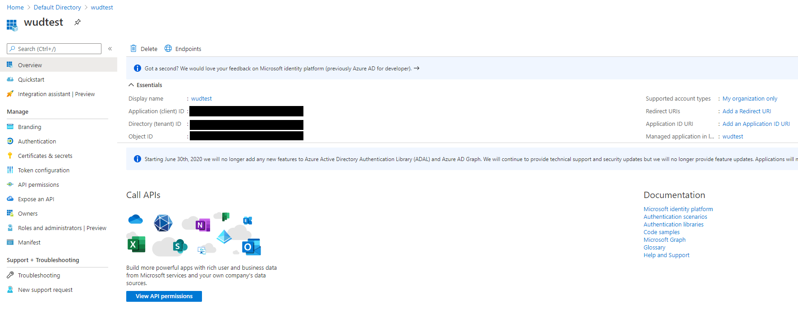
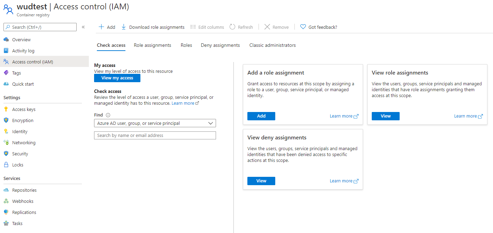
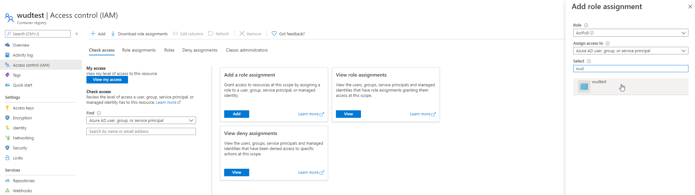

import DocHero from '@site/src/components/DocHero';
import { ConfigList, ConfigOption } from '@site/src/components/ConfigOption';
import Tabs from '@theme/Tabs';
import TabItem from '@theme/TabItem';

# Azure Container Registry (ACR)

<DocHero
  icon="acr"
  badge="🔐 Setup Required"
  badgeType="setup"
  description="The acr registry module lets you authenticate against Azure Container Registry (ACR) instances."
/>

---

## ⚙️ Configuration Variables

<ConfigList>
  <ConfigOption
    name="WUD_REGISTRY_ACR_{registry_name}_CLIENTID"
    required={true}
    type="string"
    supported="Valid Azure Service Principal Application (Client) ID UUID">
    Azure Service Principal Application (Client) ID
  </ConfigOption>

  <ConfigOption
    name="WUD_REGISTRY_ACR_{registry_name}_CLIENTSECRET"
    required={true}
    type="string"
    supported="Valid Azure Service Principal Client Secret">
    Azure Service Principal Client Secret
  </ConfigOption>

  <ConfigOption
    name="WUD_REGISTRY_ACR_{registry_name}_NAME"
    required={false}
    type="string"
    defaultValue="{registry_name}.azurecr.io"
    supported="Full registry domain name">
    Registry domain name (e.g. `myregistry.azurecr.io`)
  </ConfigOption>
</ConfigList>

:::info[Required Permissions]
Ensure your Azure Service Principal is assigned the `AcrPull` role on the target Container Registry. See [Azure Service Principal Authentication](https://learn.microsoft.com/azure/container-registry/container-registry-auth-service-principal).
:::

---

## 🚀 Examples

### Authenticate with an Azure Container Registry

<Tabs>
<TabItem value="docker-compose" label="Docker Compose">

```yaml
services:
  whatsupdocker:
    image: getwud/wud
    environment:
      - WUD_REGISTRY_ACR_MYREGISTRY_CLIENTID=00000000-0000-0000-0000-000000000000
      - WUD_REGISTRY_ACR_MYREGISTRY_CLIENTSECRET=xxxxxxxxxxxxxxxxxxxxxxxxxxxxxxxxxx
```

</TabItem>
<TabItem value="docker" label="Docker">

```bash
docker run \
  -e WUD_REGISTRY_ACR_MYREGISTRY_CLIENTID="00000000-0000-0000-0000-000000000000" \
  -e WUD_REGISTRY_ACR_MYREGISTRY_CLIENTSECRET="xxxxxxxxxxxxxxxxxxxxxxxxxxxxxxxxxx" \
  getwud/wud
```

</TabItem>
</Tabs>

---

## 📖 Setup Guide: Creating Azure Service Principal Credentials

### 1. Create a Service Principal
Follow the [official Azure guide](https://docs.microsoft.com/azure/active-directory/develop/howto-create-service-principal-portal) to register an application and generate a client secret in Microsoft Entra ID.



### 2. Open Access Control (IAM)
Navigate to your Container Registry in the Azure Portal and select **Access Control (IAM)**.



### 3. Assign the AcrPull Role
Click **Add role assignment**, select the **AcrPull** role, and assign it to your newly created Service Principal.


