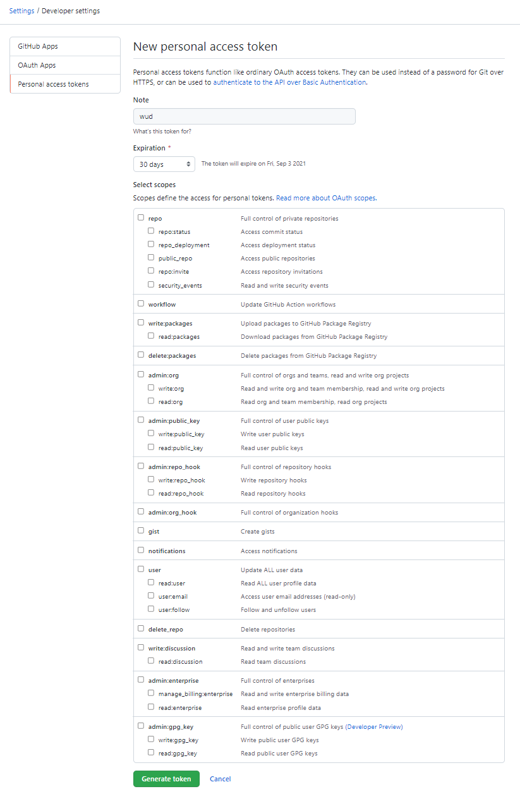
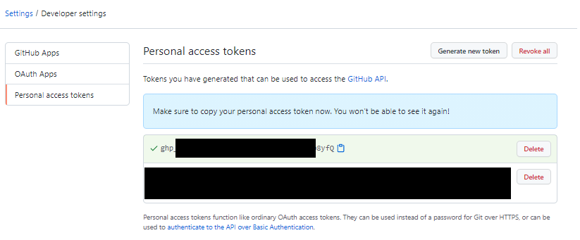

import { ConfigList, ConfigOption } from '@site/src/components/ConfigOption';
import Tabs from '@theme/Tabs';
import TabItem from '@theme/TabItem';

# GHCR (GitHub Container Registry)


The `ghcr` registry module lets you authenticate against the [GitHub Container Registry](https://docs.github.com/en/packages/working-with-a-github-packages-registry/working-with-the-docker-registry).

:::info[Public GHCR images work out of the box without authentication. Configure this module to access private repositories or avoid rate limits.]
:::

### Variables

<ConfigList>
  <ConfigOption name="WUD_REGISTRY_GHCR_{registry_name}_TOKEN"
    type="email"
    required={false}
    supported="Valid GitHub PAT">
    GitHub Personal Access Token
  </ConfigOption>

  <ConfigOption
    name="WUD_REGISTRY_GHCR_{registry_name}_USERNAME"
    required={false}
    type="string">
    GitHub username
  </ConfigOption>
</ConfigList>
### Examples

#### Authenticate to access private images

<Tabs>
<TabItem value="docker-compose" label="Docker Compose">

```yaml
services:
  whatsupdocker:
    image: getwud/wud
    ...
    environment:
      - WUD_REGISTRY_GHCR_PRIVATE_USERNAME=johndoe
      - WUD_REGISTRY_GHCR_PRIVATE_TOKEN=ghp_xxxxxxxxxxxxxxxxxxxx
```

</TabItem>
<TabItem value="docker" label="Docker">

```bash
docker run \
  -e WUD_REGISTRY_GHCR_PRIVATE_USERNAME="johndoe" \
  -e WUD_REGISTRY_GHCR_PRIVATE_TOKEN="ghp_xxxxxxxxxxxxxxxxxxxx" \
  ...
  getwud/wud
```

</TabItem>
</Tabs>

### How to create a GitHub Personal Access Token

#### 1. Open your GitHub Personal Access Tokens settings

Navigate to [GitHub Token Settings](https://github.com/settings/tokens).

#### 2. Click "Generate new token (classic)"

Set an expiration date and select the `read:packages` scope (the only scope required by WUD).


#### 3. Copy the token and configure WUD


