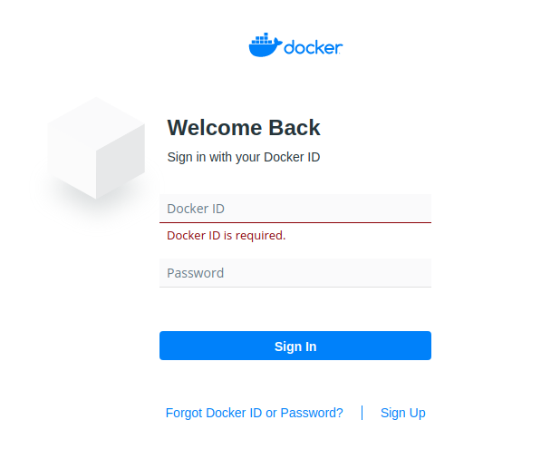
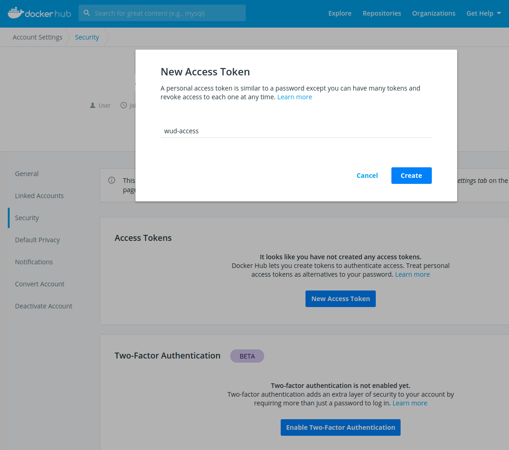

import Tabs from '@theme/Tabs';
import TabItem from '@theme/TabItem';

# Docker Hub (including private repositories)


The `hub` registry module lets you configure authentication and settings for [Docker Hub](https://hub.docker.com/).

Supported authentication methods:

- Docker Hub username + Personal Access Token (recommended)
- Docker Base64 credentials (as found in `~/.docker/config.json`)
- Docker Hub username + password (not recommended)

:::warning
By default, WUD connects to Docker Hub anonymously. Configure authentication if you need to access [Docker Hub Private Repositories](https://docs.docker.com/docker-hub/repos/#private-repositories) or increase your rate limits.
:::

### Variables

| Env var                                              |    Required    | Description                                                           | Supported values                           | Default value when missing |
| ---------------------------------------------------- | :------------: | --------------------------------------------------------------------- | ------------------------------------------ | -------------------------- |
| `WUD_REGISTRY_HUB_PUBLIC_LOGIN`                      | :white_circle: | Docker Hub username                                                   | Required when password/token is provided   |                            |
| `WUD_REGISTRY_HUB_PUBLIC_PASSWORD`                   | :white_circle: | Docker Hub Personal Access Token or password                          | Required when username is provided         |                            |
| `WUD_REGISTRY_HUB_PUBLIC_TOKEN`                      | :white_circle: | Docker Hub token (deprecated; use `WUD_REGISTRY_HUB_PUBLIC_PASSWORD`) | Required when username is provided         |                            |
| `WUD_REGISTRY_HUB_PUBLIC_AUTH`                       | :white_circle: | Base64-encoded `username:password` string                             | Mutually exclusive with `LOGIN`/`PASSWORD` |                            |
| `WUD_REGISTRY_HUB_PUBLIC_WATCHDIGEST`                | :white_circle: | Globally track image digests on Docker Hub                            | `true`, `false`                            | `false`                    |
| `WUD_REGISTRY_HUB_PUBLIC_SUPPRESSDIGESTWATCHWARNING` | :white_circle: | Suppress warning logs when digest watching without credentials        | `true`, `false`                            | `false`                    |

### Examples

#### Authenticate using username and Access Token

##### 1. Log in to your [Docker Hub Account](https://hub.docker.com/)



##### 2. Open [Security Settings](https://hub.docker.com/settings/security)

- Create a new Personal Access Token with `Read-only` permissions
- Copy the token value and set it as `WUD_REGISTRY_HUB_PUBLIC_PASSWORD`



<Tabs>
<TabItem value="docker-compose" label="Docker Compose">

```yaml
services:
  whatsupdocker:
    image: getwud/wud
    ...
    environment:
      - WUD_REGISTRY_HUB_PUBLIC_LOGIN=mylogin
      - WUD_REGISTRY_HUB_PUBLIC_PASSWORD=dckr_pat_xxxxxxxxxxxxxxxxxxxx
```

</TabItem>
<TabItem value="docker" label="Docker">

```bash
docker run \
  -e WUD_REGISTRY_HUB_PUBLIC_LOGIN="mylogin" \
  -e WUD_REGISTRY_HUB_PUBLIC_PASSWORD="dckr_pat_xxxxxxxxxxxxxxxxxxxx" \
  ...
  getwud/wud
```

</TabItem>
</Tabs>

#### Authenticate using Base64-encoded credentials

##### 1. Create an Access Token

[See above](#authenticate-using-username-and-access-token).

##### 2. Encode credentials with Base64

Concatenate `$username:$token` and [encode with Base64](https://www.base64encode.org/).

For example:

- Username: `johndoe`
- Token: `2c1bd872-efb6-4f3a-81aa-724518a0a592`
- String to encode: `johndoe:2c1bd872-efb6-4f3a-81aa-724518a0a592`
- Resulting Base64 string: `am9obmRvZToyYzFiZDg3Mi1lZmI2LTRmM2EtODFhYS03MjQ1MThhMGE1OTI=`

<Tabs>
<TabItem value="docker-compose" label="Docker Compose">

```yaml
services:
  whatsupdocker:
    image: getwud/wud
    ...
    environment:
      - WUD_REGISTRY_HUB_PUBLIC_AUTH=am9obmRvZToyYzFiZDg3Mi1lZmI2LTRmM2EtODFhYS03MjQ1MThhMGE1OTI=
```

</TabItem>
<TabItem value="docker" label="Docker">

```bash
docker run \
  -e WUD_REGISTRY_HUB_PUBLIC_AUTH="am9obmRvZToyYzFiZDg3Mi1lZmI2LTRmM2EtODFhYS03MjQ1MThhMGE1OTI=" \
  ...
  getwud/wud
```

</TabItem>
</Tabs>

#### Enable global digest watching

By default, WUD tracks updates by comparing semver image tags. You can enable digest watching to detect updates even when tags remain unchanged.

:::info
Digest watching is useful for tracking mutable tags like `latest`, `stable`, or `nightly`.
:::

<Tabs>
<TabItem value="docker-compose" label="Docker Compose">

```yaml
services:
  whatsupdocker:
    image: getwud/wud
    ...
    environment:
      - WUD_REGISTRY_HUB_PUBLIC_WATCHDIGEST=true
```

</TabItem>
<TabItem value="docker" label="Docker">

```bash
docker run \
  -e WUD_REGISTRY_HUB_PUBLIC_WATCHDIGEST="true" \
  ...
  getwud/wud
```

</TabItem>
</Tabs>

### Docker Hub Rate Limiting

:::warning
Docker Hub enforces [rate limits](https://docs.docker.com/docker-hub/download-rate-limit/) on API requests. These limits can affect WUD's ability to check for updates, especially when digest watching is enabled.
:::

#### Understanding Docker Hub rate limits

Docker Hub limits image manifest requests based on your account tier:

- **Anonymous users**: 100 pulls per 6 hours per IP address
- **Authenticated users (free tier)**: 200 pulls per 6 hours
- **Pro / Team subscriptions**: Higher or unlimited quotas

#### How rate limiting affects WUD

When digest watching is enabled (`WUD_REGISTRY_HUB_PUBLIC_WATCHDIGEST=true`), WUD makes registry API calls to inspect manifests for each monitored image, consuming quota more quickly.

#### Recommendations to avoid rate limit issues

1. **Authenticate with Docker Hub**: Use a personal access token to double your quota from 100 to 200 requests per 6 hours.

   ```yaml
   - WUD_REGISTRY_HUB_PUBLIC_LOGIN=mylogin
   - WUD_REGISTRY_HUB_PUBLIC_PASSWORD=your-access-token
   ```

2. **Reduce watcher check frequency**: Adjust the CRON schedule to check less often.

   ```yaml
   - WUD_WATCHER_LOCAL_CRON=0 20 * * * # daily at 8:00 PM
   ```

3. **Enable digest watching selectively**: Use the `wud.watch.digest=true` label on specific containers instead of enabling it globally.

   ```yaml
   labels:
     - wud.watch.digest=true
   ```

4. **Consider upgrading**: Docker Hub Pro and Team tiers offer higher rate limits.

5. **Suppress warning logs**: If you understand the limitations and want to silence warnings:
   ```yaml
   - WUD_REGISTRY_HUB_PUBLIC_SUPPRESSDIGESTWATCHWARNING=true
   ```

:::info
If you encounter rate limit errors, check your usage on [Docker Hub](https://hub.docker.com/usage/pulls).
:::
