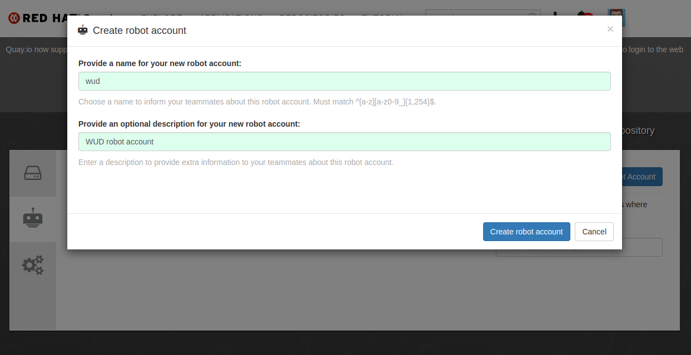
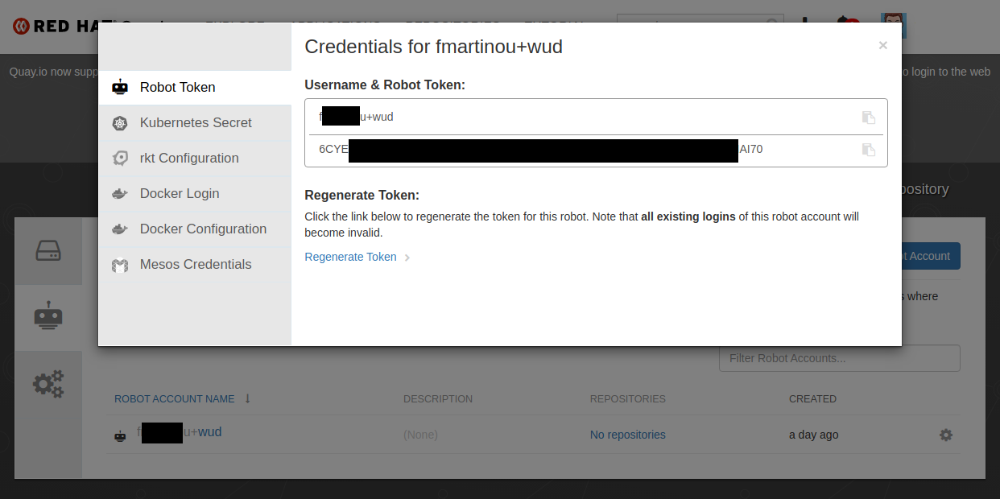

import { ConfigList, ConfigOption } from '@site/src/components/ConfigOption';
import Tabs from '@theme/Tabs';
import TabItem from '@theme/TabItem';

# Quay (Red Hat Quay)


The `quay` registry module lets you authenticate against [Quay.io](https://quay.io/) and self-hosted Red Hat Quay registries.

:::info[Zero-Config for Public Images]
Public Quay images work out of the box with zero configuration. Configure this module to authenticate against private repositories or organizations.
:::

---

## ⚙️ Configuration Variables

<ConfigList>
  <ConfigOption
    name="WUD_REGISTRY_QUAY_{registry_name}_NAMESPACE"
    required={true}
    type="string"
    supported="Quay organization or user namespace">
    Quay organization or username namespace
  </ConfigOption>

  <ConfigOption
    name="WUD_REGISTRY_QUAY_{registry_name}_ACCOUNT"
    required={true}
    type="string"
    supported="Robot account name (without namespace)">
    Quay robot account name
  </ConfigOption>

  <ConfigOption name="WUD_REGISTRY_QUAY_{registry_name}_TOKEN"
    required={true}
    type="string"
    supported="Robot account token string">
    Quay robot account secret token
  </ConfigOption>
</ConfigList>

---

## 🚀 Examples

### Authenticate with a Quay Robot Account

<Tabs>
<TabItem value="docker-compose" label="Docker Compose">

```yaml
services:
  whatsupdocker:
    image: getwud/wud
    environment:
      - WUD_REGISTRY_QUAY_LOCAL_NAMESPACE=myorg
      - WUD_REGISTRY_QUAY_LOCAL_ACCOUNT=myrobot
      - WUD_REGISTRY_QUAY_LOCAL_TOKEN=BA8JI3Y2BWQDH849RYT3YD5J0J6CYEORYTQMMJK364B4P88VPTJIAI704L0BBP8D6CYE4P88V
```

</TabItem>
<TabItem value="docker" label="Docker">

```bash
docker run \
  -e WUD_REGISTRY_QUAY_LOCAL_NAMESPACE="myorg" \
  -e WUD_REGISTRY_QUAY_LOCAL_ACCOUNT="myrobot" \
  -e WUD_REGISTRY_QUAY_LOCAL_TOKEN="BA8JI3Y2BWQDH849RYT3YD5J0J6CYEORYTQMMJK364B4P88VPTJIAI704L0BBP8D6CYE4P88V" \
  getwud/wud
```

</TabItem>
</Tabs>

---

## 📖 Setup Guide: Creating a Quay.io Robot Account

1. Open your Quay.io Organization or User Settings and select **Robot Accounts**.
2. Click **Create Robot Account**, name it (e.g. `wud`), and grant read permissions to the appropriate repositories.



3. Robot account names follow the format `<namespace>+<account>`.
   - Set the part before the `+` as `WUD_REGISTRY_QUAY_{registry_name}_NAMESPACE`.
   - Set the part after the `+` as `WUD_REGISTRY_QUAY_{registry_name}_ACCOUNT`.
   - Copy the generated token string into `WUD_REGISTRY_QUAY_{registry_name}_TOKEN`.


