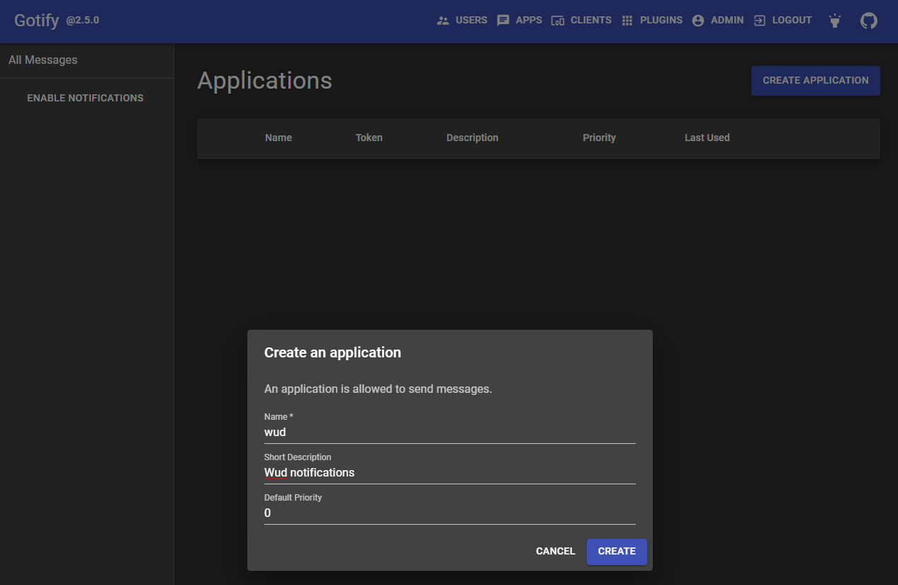
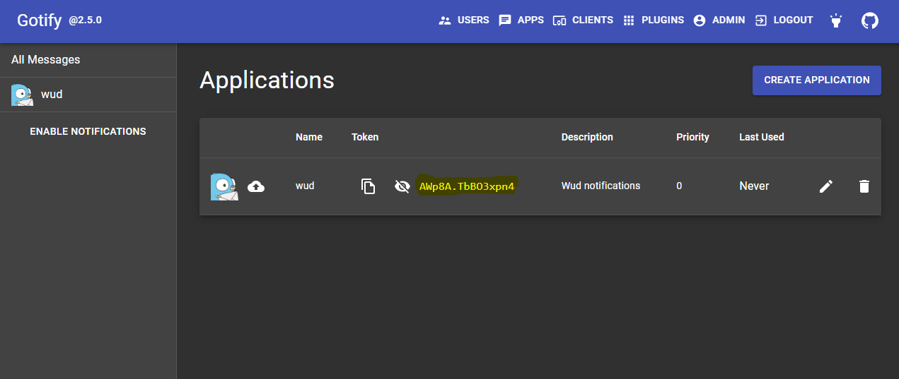

import Tabs from '@theme/Tabs';
import TabItem from '@theme/TabItem';

# Gotify


The `gotify` trigger lets you send container update notifications via [Gotify](https://gotify.net/).

### Variables

| Env var                                      |    Required    | Description              | Supported values       | Default value when missing |
| -------------------------------------------- | :------------: | ------------------------ | ---------------------- | -------------------------- |
| `WUD_TRIGGER_GOTIFY_{trigger_name}_PRIORITY` | :white_circle: | Gotify message priority  | Integer >= `0`         | `5`                        |
| `WUD_TRIGGER_GOTIFY_{trigger_name}_TOKEN`    |  :red_circle:  | Gotify application token | Valid Gotify app token |                            |
| `WUD_TRIGGER_GOTIFY_{trigger_name}_URL`      |  :red_circle:  | Gotify server base URL   | Valid HTTP/HTTPS URL   |                            |

:::info
This trigger also supports [common trigger configuration options](../README.md#common-trigger-configuration).
:::

### Examples

#### 1. Create an application in Gotify



#### 2. Copy the application token



#### 3. Configure WUD

<Tabs>
<TabItem value="docker-compose" label="Docker Compose">

```yaml
services:
  whatsupdocker:
    image: getwud/wud
    ...
    environment:
      - WUD_TRIGGER_GOTIFY_LOCAL_URL=http://gotify.localhost
      - WUD_TRIGGER_GOTIFY_LOCAL_TOKEN=AWp8A.TbBO3xpn4
```

</TabItem>
<TabItem value="docker" label="Docker">

```bash
docker run \
  -e WUD_TRIGGER_GOTIFY_LOCAL_URL="http://gotify.localhost" \
  -e WUD_TRIGGER_GOTIFY_LOCAL_TOKEN="AWp8A.TbBO3xpn4" \
  ...
  getwud/wud
```

</TabItem>
</Tabs>
