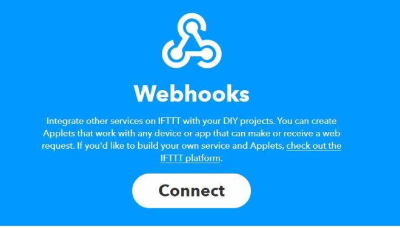
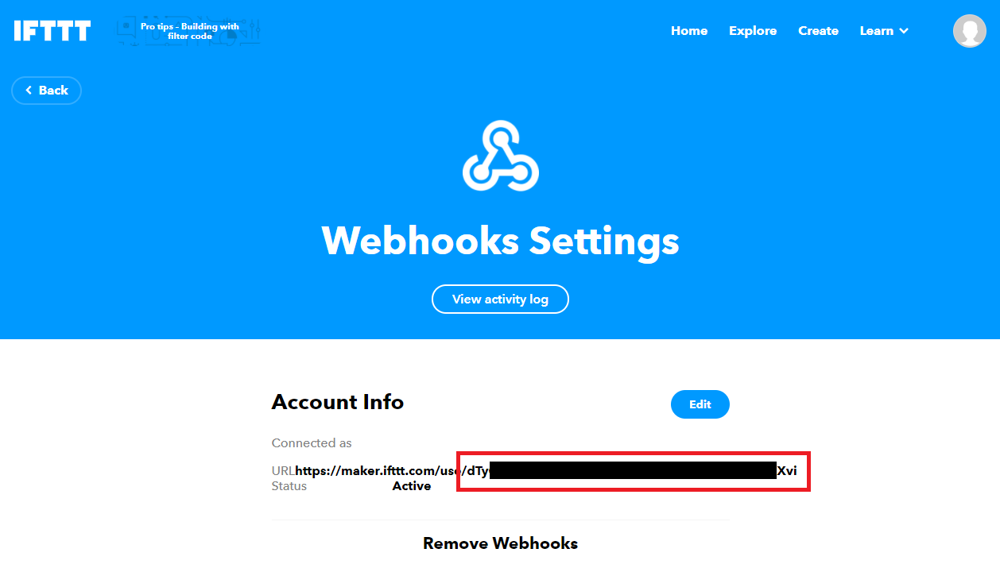
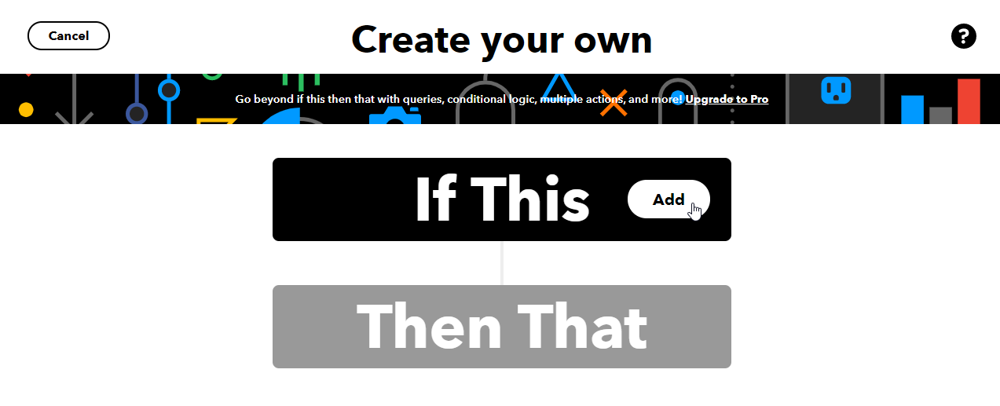
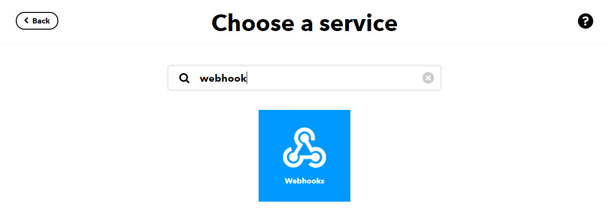
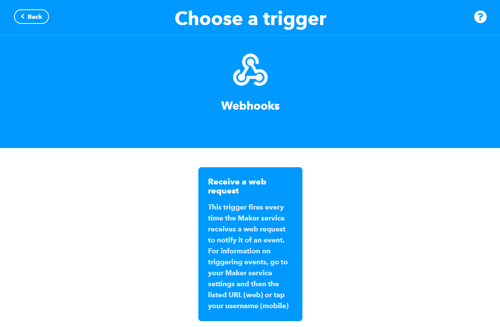
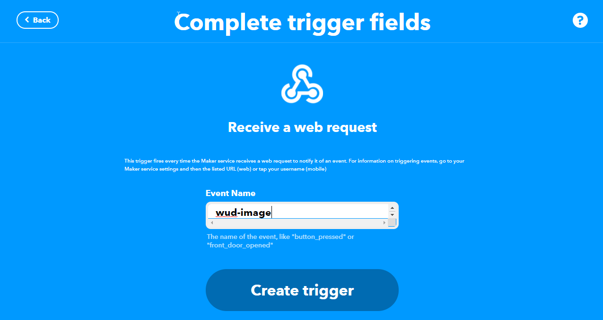
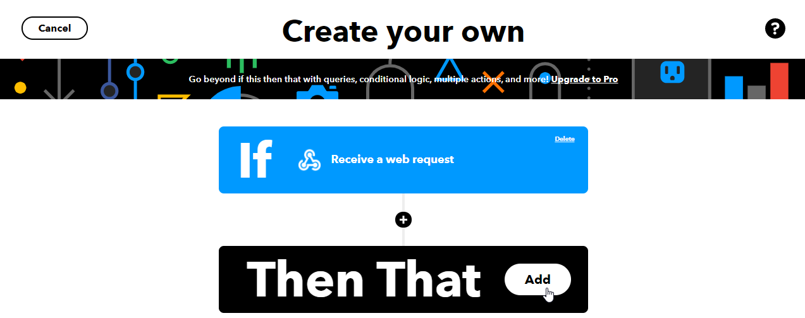

import Tabs from '@theme/Tabs';
import TabItem from '@theme/TabItem';

# IFTTT


The `ifttt` trigger lets you send container update notifications to IFTTT via the [Maker Webhooks service](https://ifttt.com/maker_webhooks/).

### Variables

| Env var                                  |    Required    | Description              | Supported values | Default value when missing |
| ---------------------------------------- | :------------: | ------------------------ | ---------------- | -------------------------- |
| `WUD_TRIGGER_IFTTT_{trigger_name}_KEY`   |  :red_circle:  | IFTTT Webhook API key    | String           |                            |
| `WUD_TRIGGER_IFTTT_{trigger_name}_EVENT` | :white_circle: | IFTTT Webhook event name | String           | `wud-image`                |

:::info
This trigger also supports [common trigger configuration options](../README.md#common-trigger-configuration).
:::

### IFTTT Ingredients

When triggering the webhook, WUD provides the following ingredients to IFTTT:

- `EventName`: Event name (e.g., `wud-image` or `wud-container`)
- `OccurredAt`: Timestamp of the event
- `Value1`: Monitored container image / name
- `Value2`: New tag / version available
- `Value3`: Full container JSON payload

### Examples

#### Basic Configuration

<Tabs>
<TabItem value="docker-compose" label="Docker Compose">

```yaml
services:
  whatsupdocker:
    image: getwud/wud
    ...
    environment:
      - WUD_TRIGGER_IFTTT_PROD_KEY=your_ifttt_webhook_key
```

</TabItem>
<TabItem value="docker" label="Docker">

```bash
docker run \
  -e WUD_TRIGGER_IFTTT_PROD_KEY="your_ifttt_webhook_key" \
  ...
  getwud/wud
```

</TabItem>
</Tabs>

#### Example of Captured IFTTT Ingredients

- **EventName**: `wud-container`
- **OccurredAt**: `August 30, 2024 at 06:51PM`
- **Value1**: `homeassistant`
- **Value2**: `2024.6.5`
- **Value3**: `{"id":"31a61a8305ef1fc9a71fa4f20a68d7ec88b28e32303bbc4a5f192e851165b816","name":"homeassistant","watcher":"local","image":{"name":"homeassistant/home-assistant","tag":{"value":"2024.6.4"}},"result":{"tag":"2024.6.5"},"updateAvailable":true}`

### How to obtain your IFTTT Webhook Key

#### 1. Open the Webhooks service and connect

Navigate to [IFTTT Maker Webhooks](https://ifttt.com/maker_webhooks) and click **Connect**.


#### 2. Copy your key from the settings

Open [Webhooks Settings](https://ifttt.com/maker_webhooks/settings) and copy the key from the URL.


### How to create an IFTTT Applet

#### 1. Create a new Applet and add an "If This" trigger

Navigate to [IFTTT Applet Creator](https://ifttt.com/create).


#### 2. Search for the "Webhooks" service



#### 3. Select the "Receive a web request" trigger



#### 4. Enter the event name (e.g., `wud-image`)



#### 5. Define the "Then That" action

Select any action service (e.g., Send an email, Push notification, Smart home action).

