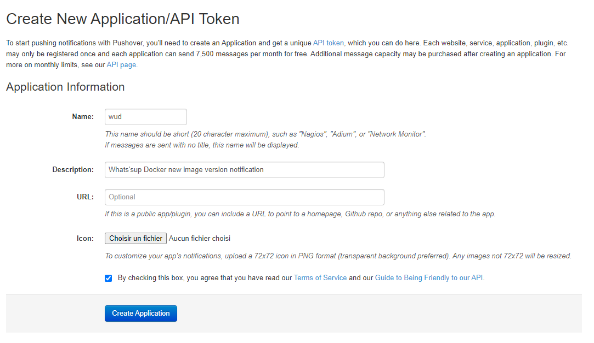
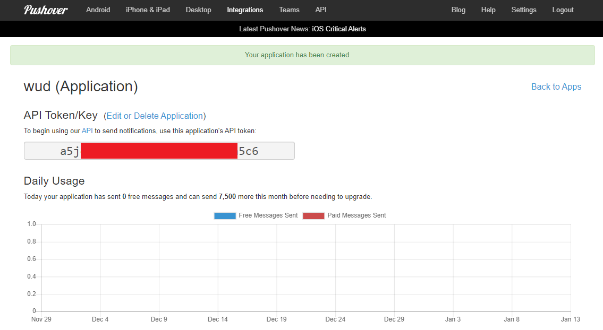

import { ConfigList, ConfigOption } from '@site/src/components/ConfigOption';
import Tabs from '@theme/Tabs';
import TabItem from '@theme/TabItem';

# Pushover


The `pushover` trigger lets you send real-time container update notifications to mobile devices and desktops using the [Pushover](https://pushover.net/) push notification service.

### Variables

<ConfigList>
  <ConfigOption name="WUD_TRIGGER_PUSHOVER_{trigger_name}_TOKEN"
    required={true}
    type="email">
    Pushover Application API token
  </ConfigOption>

  <ConfigOption
    name="WUD_TRIGGER_PUSHOVER_{trigger_name}_USER"
    required={true}
    type="string">
    Pushover User Key (or Group Key)
  </ConfigOption>

  <ConfigOption
    name="WUD_TRIGGER_PUSHOVER_{trigger_name}_DEVICE"
    required={false}
    type="url"
    supported="[Pushover device identifiers](https://pushover.net/api#identifiers)">
    Target device name(s) (comma-separated, e.g., `dev1,dev2`)
  </ConfigOption>

  <ConfigOption
    name="WUD_TRIGGER_PUSHOVER_{trigger_name}_EXPIRE"
    required={false}
    type="url"
    supported="Integer (up to 86400) [see docs](https://pushover.net/api#priority)">
    Notification expiration time in seconds (only when priority=`2`)
  </ConfigOption>

  <ConfigOption
    name="WUD_TRIGGER_PUSHOVER_{trigger_name}_HTML"
    required={false}
    type="url"
    defaultValue="0"
    supported="`1` (true), `0` (false) [see docs](https://pushover.net/api#html)">
    Allow HTML formatting in message body
  </ConfigOption>

  <ConfigOption
    name="WUD_TRIGGER_PUSHOVER_{trigger_name}_PRIORITY"
    required={false}
    type="url"
    defaultValue="0"
    supported="[Pushover message priority](https://pushover.net/api#priority)">
    Notification priority level (`-2` to `2`)
  </ConfigOption>

  <ConfigOption
    name="WUD_TRIGGER_PUSHOVER_{trigger_name}_RETRY"
    required={false}
    type="url"
    supported="Integer (minimum 30) [see docs](https://pushover.net/api#priority)">
    Notification retry interval in seconds (only when priority=`2`)
  </ConfigOption>

  <ConfigOption
    name="WUD_TRIGGER_PUSHOVER_{trigger_name}_SOUND"
    required={false}
    type="url"
    defaultValue="pushover"
    supported="[Supported Pushover sounds](https://pushover.net/api#sounds)">
    Notification sound
  </ConfigOption>

  <ConfigOption
    name="WUD_TRIGGER_PUSHOVER_{trigger_name}_TTL"
    required={false}
    type="url"
    supported="[Pushover TTL docs](https://pushover.net/api#ttl)">
    Message Time to Live in seconds
  </ConfigOption>
</ConfigList>
:::info
This trigger also supports [common trigger configuration options](../README.md#common-trigger-configuration).
:::

### Examples

#### Minimal configuration

<Tabs>
<TabItem value="docker-compose" label="Docker Compose">

```yaml
services:
  whatsupdocker:
    image: getwud/wud
    ...
    environment:
      - WUD_TRIGGER_PUSHOVER_1_USER=your_user_key
      - WUD_TRIGGER_PUSHOVER_1_TOKEN=your_app_token
```

</TabItem>
<TabItem value="docker" label="Docker">

```bash
docker run \
  -e WUD_TRIGGER_PUSHOVER_1_USER="your_user_key" \
  -e WUD_TRIGGER_PUSHOVER_1_TOKEN="your_app_token" \
  ...
  getwud/wud
```

</TabItem>
</Tabs>

#### Advanced configuration (Emergency priority)

<Tabs>
<TabItem value="docker-compose" label="Docker Compose">

```yaml
services:
  whatsupdocker:
    image: getwud/wud
    ...
    environment:
      - WUD_TRIGGER_PUSHOVER_1_USER=your_user_key
      - WUD_TRIGGER_PUSHOVER_1_TOKEN=your_app_token
      - WUD_TRIGGER_PUSHOVER_1_DEVICE=myIphone,mySamsung
      - WUD_TRIGGER_PUSHOVER_1_SOUND=cosmic
      - WUD_TRIGGER_PUSHOVER_1_PRIORITY=2
      - WUD_TRIGGER_PUSHOVER_1_EXPIRE=600
      - WUD_TRIGGER_PUSHOVER_1_RETRY=60
```

</TabItem>
<TabItem value="docker" label="Docker">

```bash
docker run \
  -e WUD_TRIGGER_PUSHOVER_1_USER="your_user_key" \
  -e WUD_TRIGGER_PUSHOVER_1_TOKEN="your_app_token" \
  -e WUD_TRIGGER_PUSHOVER_1_DEVICE="myIphone,mySamsung" \
  -e WUD_TRIGGER_PUSHOVER_1_SOUND="cosmic" \
  -e WUD_TRIGGER_PUSHOVER_1_PRIORITY="2" \
  -e WUD_TRIGGER_PUSHOVER_1_EXPIRE="600" \
  -e WUD_TRIGGER_PUSHOVER_1_RETRY="60" \
  ...
  getwud/wud
```

</TabItem>
</Tabs>

### How to get your Pushover credentials

#### 1. Copy your User Key

Log in to your [Pushover Account Dashboard](https://pushover.net/). Your **User Key** is displayed in the top right corner.

#### 2. Create an Application API Token

Create a new application in the [Pushover Application Registration page](https://pushover.net/apps/build).



#### 3. Copy the API Token

Copy the generated API token from your newly created application.


