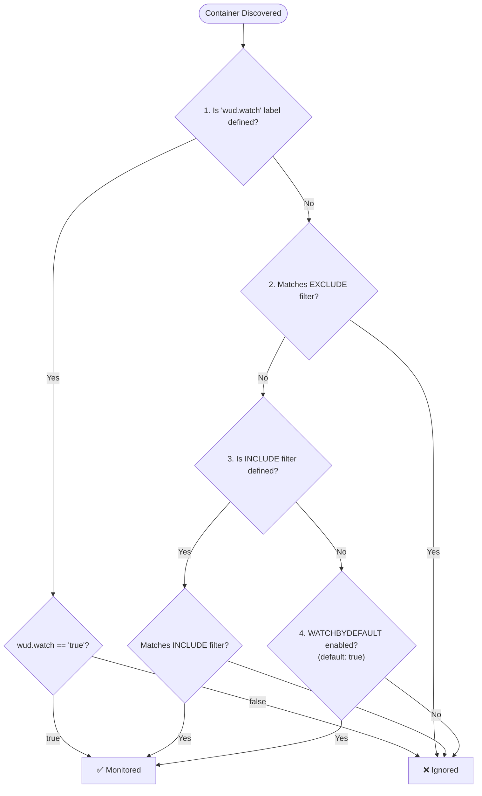

import DocHero from '@site/src/components/DocHero';
import { ConfigList, ConfigOption } from '@site/src/components/ConfigOption';
import Tabs from '@theme/Tabs';
import TabItem from '@theme/TabItem';

# Watchers Overview

<DocHero
  icon="docker"
  badge="Multi-Orchestrator"
  badgeType="default"
  description="Watchers are responsible for discovering and scanning containers across your infrastructure, whether on Docker daemons or Kubernetes clusters."
/>

## Supported Environments

WUD provides dedicated watchers tailored for your infrastructure:

| Environment | Documentation | Description |
| :--- | :--- | :--- |
| 🐳 **Docker** | [**Docker Configuration ↓**](#docker-configuration) | Local sockets, Remote TCP daemons, and Docker Compose stacks. |
| 🐝 **Docker Swarm** | [**Docker Swarm Watcher Guide →**](./swarm/README.md) | Swarm manager socket/TCP, services, stack namespaces, digests. |
| ☸️ **Kubernetes** | [**Kubernetes Watcher Guide →**](./kubernetes/README.md) | In-cluster RBAC, Deployments, StatefulSets, DaemonSets, CronJobs. |
| 🎯 **Nomad** | [**Nomad Watcher Guide →**](./nomad/README.md) | HashiCorp Nomad jobs (`service`, `batch`, `system`) and task groups. |

---

## Docker Configuration

:::info[Default Watcher]
If no watcher is explicitly configured, a default watcher named `local` is automatically created, monitoring `/var/run/docker.sock`.
:::

:::tip[Per-Workload Configuration]
To customize how WUD monitors specific containers or workloads (opt-in/opt-out, tag filtering, semver transforms, custom display names, or trigger routing), see the comprehensive [**Workload Customization guide**](labels.md).
:::

### Configuration Options

<ConfigList>
  <ConfigOption
    name="WUD_WATCHER_{watcher_name}_CAFILE"
    type="path"
    required={false}
    supported="File path">
    Path to CA certificate PEM file (for TLS connection only)
  </ConfigOption>

  <ConfigOption
    name="WUD_WATCHER_{watcher_name}_CERTFILE"
    type="path"
    required={false}
    supported="File path">
    Path to client certificate PEM file (for TLS connection only)
  </ConfigOption>

  <ConfigOption
    name="WUD_WATCHER_{watcher_name}_CRON"
    required={false}
    type="url"
    defaultValue="0 * * * *"
    supported="[Valid CRON expression](https://crontab.guru/)">
    CRON schedule for automatic checks
  </ConfigOption>

  <ConfigOption
    name="WUD_WATCHER_{watcher_name}_DELAY"
    type="string"
    required={false}
    supported="Duration string (e.g. `30s`, `10m`, `24h`, `3d`, `1w`)">
    Cool-down period before considering an update available for discovered containers
  </ConfigOption>

  <ConfigOption
    name="WUD_WATCHER_{watcher_name}_EXCLUDE"
    type="string"
    required={false}
    supported="Regular expression pattern (e.g. `^ix-.*`, `.*-dev$`, `label:env=dev`)">
    Regex pattern to exclude containers by name or labels (using `label:` prefix) from being watched. See [Container Filtering & Precedence Rules](#container-filtering--precedence-rules).
  </ConfigOption>

  <ConfigOption
    name="WUD_WATCHER_{watcher_name}_HOST"
    type="string"
    required={false}
    supported="Hostname or IP">
    Docker daemon hostname or IP address to monitor
  </ConfigOption>

  <ConfigOption
    name="WUD_WATCHER_{watcher_name}_INCLUDE"
    type="string"
    required={false}
    supported="Regular expression pattern (e.g. `^prod-.*`, `label:tier=frontend`)">
    Regex pattern to include containers by name or labels (using `label:` prefix) to be watched. See [Container Filtering & Precedence Rules](#container-filtering--precedence-rules).
  </ConfigOption>

  <ConfigOption
    name="WUD_WATCHER_{watcher_name}_JITTER"
    type="integer"
    required={false}
    defaultValue="60000"
    supported="> 0">
    Random jitter in milliseconds applied to the CRON schedule to distribute load across registries (primarily Docker Hub)
  </ConfigOption>

  <ConfigOption
    name="WUD_WATCHER_{watcher_name}_KEYFILE"
    type="path"
    required={false}
    supported="File path">
    Path to client private key PEM file (for TLS connection only)
  </ConfigOption>

  <ConfigOption
    name="WUD_WATCHER_{watcher_name}_PORT"
    required={false}
    type="integer"
    defaultValue="2375"
    supported="Port number">
    Docker daemon TCP port to connect to
  </ConfigOption>

  <ConfigOption
    name="WUD_WATCHER_{watcher_name}_SOCKET"
    type="path"
    required={false}
    defaultValue="/var/run/docker.sock"
    supported="Valid UNIX socket path">
    Docker UNIX socket path to monitor
  </ConfigOption>

  <ConfigOption
    name="WUD_WATCHER_{watcher_name}_WATCHALL"
    required={false}
    type="boolean"
    defaultValue="false">
    Whether WUD should monitor all containers instead of only running ones
  </ConfigOption>

  <ConfigOption
    name="WUD_WATCHER_{watcher_name}_WATCHATSTART"
    required={false}
    type="boolean"
    defaultValue="true">
    Whether WUD should check for image updates during startup
  </ConfigOption>

  <ConfigOption
    name="WUD_WATCHER_{watcher_name}_WATCHBYDEFAULT"
    required={false}
    type="boolean"
    defaultValue="true">
    Whether WUD should monitor all discovered containers by default. See [Container Filtering & Precedence Rules](#container-filtering--precedence-rules).
  </ConfigOption>

  <ConfigOption
    name="WUD_WATCHER_{watcher_name}_WATCHDIGESTDEFAULT"
    required={false}
    type="boolean"
    defaultValue="false (Hub), true (others)">
    Whether WUD should watch digest for tags that are not semantic versions, acting as a fallback when not defined in registry config.
  </ConfigOption>

  <ConfigOption
    name="WUD_WATCHER_{watcher_name}_WATCHEVENTS"
    required={false}
    type="boolean"
    defaultValue="true">
    Whether WUD should listen for Docker daemon events in real-time
  </ConfigOption>
</ConfigList>

:::info[Multiple & Remote Watchers]
You can configure multiple watchers to monitor both local and remote Docker hosts simultaneously.

- **Filtering & Precedence Rules**: To learn how `INCLUDE`, `EXCLUDE`, and labels interact, see [**Container Filtering & Precedence Rules**](#container-filtering--precedence-rules).
- **Remote & Multi-Host**: For remote Docker connections, security proxies, SSH tunnels, mesh networks, and mutual TLS, see [**Remote Daemons & Multi-Host**](remote-tls.md).
- **Rate Limits & Digests**: To learn how digest polling works and prevent Docker Hub quota exhaustion, see [**Digest & Rate Limits**](digest-rate-limits.md).
- **Per-Container Rules**: To configure tag filtering and routing per container, see [**Container Labels**](labels.md).

:::

---

## Container Filtering & Precedence Rules

WUD provides a multi-layered filtering engine to determine whether a discovered container should be monitored for image updates. You can filter containers globally at the watcher level using regular expressions on container names or labels, or override decisions locally using container labels.

### Evaluation Priority Flow

When evaluating each discovered container, WUD processes filtering rules in a strict, descending 4-level hierarchy. The first rule that yields a definitive decision halts further evaluation:



#### Decision Levels Explained

1. **Container Label `wud.watch` (Absolute Priority)**:
   - Evaluated first. If the container defines the `wud.watch` label with a non-empty value, this value **strictly dictates** the outcome:
     - `wud.watch=true`: The container is **monitored**, even if it matches an `EXCLUDE` filter or if `WATCHBYDEFAULT=false`.
     - `wud.watch=false`: The container is **ignored**, even if it matches an `INCLUDE` filter or if `WATCHBYDEFAULT=true`.
2. **Watcher Exclude Filter (`WUD_WATCHER_{name}_EXCLUDE`)**:
   - If defined, the regex pattern is tested against the container (by name or by labels).
   - If the container matches, it is **ignored immediately** without evaluating include filters or defaults.
3. **Watcher Include Filter (`WUD_WATCHER_{name}_INCLUDE`)**:
   - If defined, the regex pattern acts as an explicit allowlist:
     - Containers that **match** the pattern are **monitored**.
     - Containers that **do not match** are **ignored**.
   - :::note
     When an `INCLUDE` filter is configured, the `WATCHBYDEFAULT` setting is bypassed for non-matching containers.
     :::
4. **Watcher Default Fallback (`WUD_WATCHER_{name}_WATCHBYDEFAULT`)**:
   - Reached only if no `wud.watch` label is present, no `EXCLUDE` filter matched, and no `INCLUDE` filter was defined.
   - Defaults to `true` (all remaining containers are monitored).
   - If set to `false`, remaining containers are ignored (strict opt-in mode).

---

### Precedence Rules Matrix

The following table summarizes how combinations of container labels and watcher configuration interact:

| Priority | Evaluation Level | Rule / Setting | Match Condition | Outcome | Description |
| :---: | :--- | :--- | :--- | :---: | :--- |
| **1** | Container Label | `wud.watch=true` | Label set to `"true"` | ✅ **Watched** | Explicit opt-in. Overrides all watcher filters (`EXCLUDE`, `INCLUDE`, `WATCHBYDEFAULT`). |
| **1** | Container Label | `wud.watch=false` | Label set to `"false"` | ❌ **Ignored** | Explicit opt-out. Overrides all watcher filters (`EXCLUDE`, `INCLUDE`, `WATCHBYDEFAULT`). |
| **2** | Watcher Filter | `EXCLUDE` | Container matches regex | ❌ **Ignored** | Excluded by container name or label regex. Takes precedence over `INCLUDE`. |
| **3** | Watcher Filter | `INCLUDE` | Container matches regex | ✅ **Watched** | Included by container name or label regex. |
| **3** | Watcher Filter | `INCLUDE` | Container does not match | ❌ **Ignored** | Excluded because it does not match the active allowlist. `WATCHBYDEFAULT` is bypassed. |
| **4** | Watcher Default | `WATCHBYDEFAULT=true` (default) | No `INCLUDE` filter active | ✅ **Watched** | Standard behavior: monitors all discovered containers. |
| **4** | Watcher Default | `WATCHBYDEFAULT=false` | No `INCLUDE` filter active | ❌ **Ignored** | Strict opt-in mode: containers ignored unless tagged with `wud.watch=true`. |

---

### Targeting Syntax: Container Names vs. Labels

Both `WUD_WATCHER_{name}_EXCLUDE` and `WUD_WATCHER_{name}_INCLUDE` support standard JavaScript regular expressions (`RegExp`), with two targeting modes:

#### 1. Container Name Matching (Default)

Without any prefix, the regex is evaluated directly against the normalized container name (e.g. `my-app` without leading `/`):

- `^prod-.*`: Matches any container whose name starts with `prod-`.
- `.*-(dev|test)$`: Matches any container whose name ends with `-dev` or `-test`.
- `^(database|redis|rabbitmq)$`: Matches exact container names.

#### 2. Label Matching (`label:<regex>`)

When the pattern starts with the `label:` prefix, WUD inspects the container's Docker metadata labels (`container.Labels`).

The regular expression following `label:` is tested against three representations for every label defined on the container:

1. **Label Key Alone**: `key` (e.g., `^com\.docker\.compose`)
2. **Key-Value with Equals**: `key=value` (e.g., `^env=production$`)
3. **Key-Value with Colon**: `key:value` (e.g., `^tier:frontend$`)

If **any** label on the container matches any of these three representations, the filter condition is satisfied.

:::tip[Case Sensitivity & Escaping]
Regex patterns in JavaScript are case-sensitive by default. Remember to escape special regex characters like dots (`\.`), dashes, or brackets when targeting reverse-DNS label namespaces (e.g. `label:^com\.docker\.compose`).
:::

---

### Filtering Cookbook

Here are production-tested recipes for common container filtering architectures:

#### Recipe 1: Monitor Docker Compose Stacks Exclusively

**Use Case**: You run a host with standalone diagnostic containers, CLI utilities, and core Docker Compose stacks. You want WUD to monitor all Compose-managed containers automatically, without editing individual Compose files.

**Why it works**: Docker Compose automatically injects labels into every service it deploys (`com.docker.compose.project`, `com.docker.compose.service`, `com.docker.compose.version`). Setting `INCLUDE=label:^com\.docker\.compose` matches these labels natively.

<Tabs>
<TabItem value="docker-compose" label="Docker Compose">

```yaml
services:
  whatsupdocker:
    image: getwud/wud
    volumes:
      - /var/run/docker.sock:/var/run/docker.sock:ro
    environment:
      - WUD_WATCHER_LOCAL_SOCKET=/var/run/docker.sock
      - WUD_WATCHER_LOCAL_INCLUDE=label:^com\.docker\.compose
```

</TabItem>
<TabItem value="docker" label="Docker">

```bash
docker run -d \
  -v /var/run/docker.sock:/var/run/docker.sock:ro \
  -e WUD_WATCHER_LOCAL_SOCKET="/var/run/docker.sock" \
  -e WUD_WATCHER_LOCAL_INCLUDE="label:^com\.docker\.compose" \
  getwud/wud
```

</TabItem>
</Tabs>

#### Recipe 2: Exclude Development & Test Containers by Name

**Use Case**: Ephemeral test containers, staging runners, or CI/CD jobs run on your Docker daemon. You want WUD to watch all production services while skipping any test or dev container.

<Tabs>
<TabItem value="docker-compose" label="Docker Compose">

```yaml
services:
  whatsupdocker:
    image: getwud/wud
    volumes:
      - /var/run/docker.sock:/var/run/docker.sock:ro
    environment:
      - WUD_WATCHER_LOCAL_SOCKET=/var/run/docker.sock
      - WUD_WATCHER_LOCAL_EXCLUDE=^(test|dev|staging)-.*
```

</TabItem>
<TabItem value="docker" label="Docker">

```bash
docker run -d \
  -v /var/run/docker.sock:/var/run/docker.sock:ro \
  -e WUD_WATCHER_LOCAL_SOCKET="/var/run/docker.sock" \
  -e WUD_WATCHER_LOCAL_EXCLUDE="^(test|dev|staging)-.*" \
  getwud/wud
```

</TabItem>
</Tabs>

#### Recipe 3: Exclude Containers by Custom Label

**Use Case**: You want to flag specific containers to be ignored by assigning a custom tag such as `wud.ignore=true` or `env=development`, without having to rename containers.

<Tabs>
<TabItem value="docker-compose" label="Docker Compose">

```yaml
services:
  whatsupdocker:
    image: getwud/wud
    volumes:
      - /var/run/docker.sock:/var/run/docker.sock:ro
    environment:
      - WUD_WATCHER_LOCAL_SOCKET=/var/run/docker.sock
      - WUD_WATCHER_LOCAL_EXCLUDE=label:^wud\.ignore=true$
```

</TabItem>
<TabItem value="docker" label="Docker">

```bash
docker run -d \
  -v /var/run/docker.sock:/var/run/docker.sock:ro \
  -e WUD_WATCHER_LOCAL_SOCKET="/var/run/docker.sock" \
  -e WUD_WATCHER_LOCAL_EXCLUDE="label:^wud\.ignore=true$" \
  getwud/wud
```

</TabItem>
</Tabs>

Any container bearing that label will be skipped:

```yaml title="Example skipped workload"
services:
  backup-job:
    image: restic/restic:latest
    labels:
      - wud.ignore=true
```

#### Recipe 4: Allowlist Production Containers by Name

**Use Case**: In high-density environments, you only want to monitor containers prefixed with `prod-` or `core-`. All other existing and future containers are ignored by default.

<Tabs>
<TabItem value="docker-compose" label="Docker Compose">

```yaml
services:
  whatsupdocker:
    image: getwud/wud
    volumes:
      - /var/run/docker.sock:/var/run/docker.sock:ro
    environment:
      - WUD_WATCHER_LOCAL_SOCKET=/var/run/docker.sock
      - WUD_WATCHER_LOCAL_INCLUDE=^(prod|core)-.*
```

</TabItem>
<TabItem value="docker" label="Docker">

```bash
docker run -d \
  -v /var/run/docker.sock:/var/run/docker.sock:ro \
  -e WUD_WATCHER_LOCAL_SOCKET="/var/run/docker.sock" \
  -e WUD_WATCHER_LOCAL_INCLUDE="^(prod|core)-.*" \
  getwud/wud
```

</TabItem>
</Tabs>

#### Recipe 5: Strict Opt-In Mode per Container

**Use Case**: In shared or multi-tenant environments, you do not want WUD to automatically discover and monitor every workload. Instead, container owners must explicitly opt in by adding `wud.watch=true`.

First, configure WUD in opt-in mode by setting `WATCHBYDEFAULT=false`:

<Tabs>
<TabItem value="docker-compose" label="Docker Compose">

```yaml
services:
  whatsupdocker:
    image: getwud/wud
    volumes:
      - /var/run/docker.sock:/var/run/docker.sock:ro
    environment:
      - WUD_WATCHER_LOCAL_SOCKET=/var/run/docker.sock
      - WUD_WATCHER_LOCAL_WATCHBYDEFAULT=false
```

</TabItem>
<TabItem value="docker" label="Docker">

```bash
docker run -d \
  -v /var/run/docker.sock:/var/run/docker.sock:ro \
  -e WUD_WATCHER_LOCAL_SOCKET="/var/run/docker.sock" \
  -e WUD_WATCHER_LOCAL_WATCHBYDEFAULT="false" \
  getwud/wud
```

</TabItem>
</Tabs>

Next, add the `wud.watch=true` label to the specific services you want WUD to monitor:

<Tabs>
<TabItem value="docker-compose" label="Docker Compose">

```yaml title="compose.yaml"
services:
  # Monitored because wud.watch=true
  web:
    image: nginx:1.27-alpine
    labels:
      - wud.watch=true

  # Ignored because WATCHBYDEFAULT=false
  redis:
    image: redis:7.2-alpine
```

</TabItem>
<TabItem value="docker" label="Docker">

```bash
# Monitored
docker run -d --name web --label wud.watch=true nginx:1.27-alpine

# Ignored
docker run -d --name redis redis:7.2-alpine
```

</TabItem>
</Tabs>

---

## Examples

### 1. Watch the local Docker host daily at 1:00 AM

<Tabs>
<TabItem value="docker-compose" label="Docker Compose">

```yaml
services:
  whatsupdocker:
    image: getwud/wud
    volumes:
      - /var/run/docker.sock:/var/run/docker.sock:ro
    environment:
      - WUD_WATCHER_LOCAL_CRON=0 1 * * *
```

</TabItem>
<TabItem value="docker" label="Docker">

```bash
docker run -d \
  -v /var/run/docker.sock:/var/run/docker.sock:ro \
  -e WUD_WATCHER_LOCAL_CRON="0 1 * * *" \
  getwud/wud
```

</TabItem>
</Tabs>

### 2. Watch all containers (including stopped / paused)

<Tabs>
<TabItem value="docker-compose" label="Docker Compose">

```yaml
services:
  whatsupdocker:
    image: getwud/wud
    volumes:
      - /var/run/docker.sock:/var/run/docker.sock:ro
    environment:
      - WUD_WATCHER_LOCAL_WATCHALL=true
```

</TabItem>
<TabItem value="docker" label="Docker">

```bash
docker run -d \
  -v /var/run/docker.sock:/var/run/docker.sock:ro \
  -e WUD_WATCHER_LOCAL_WATCHALL="true" \
  getwud/wud
```

</TabItem>
</Tabs>

### 3. Watch a remote Docker host via TCP (Port 2375)

<Tabs>
<TabItem value="docker-compose" label="Docker Compose">

```yaml
services:
  whatsupdocker:
    image: getwud/wud
    environment:
      - WUD_WATCHER_MYREMOTEHOST_HOST=myremotehost
      - WUD_WATCHER_MYREMOTEHOST_PORT=2375
```

</TabItem>
<TabItem value="docker" label="Docker">

```bash
docker run -d \
  -e WUD_WATCHER_MYREMOTEHOST_HOST="myremotehost" \
  -e WUD_WATCHER_MYREMOTEHOST_PORT="2375" \
  getwud/wud
```

</TabItem>
</Tabs>

### 4. Watch a remote Docker host with TLS (Port 2376)

<Tabs>
<TabItem value="docker-compose" label="Docker Compose">

```yaml
services:
  whatsupdocker:
    image: getwud/wud
    environment:
      - WUD_WATCHER_MYREMOTEHOST_HOST=myremotehost
      - WUD_WATCHER_MYREMOTEHOST_PORT=2376
      - WUD_WATCHER_MYREMOTEHOST_CAFILE=/certs/ca.pem
      - WUD_WATCHER_MYREMOTEHOST_CERTFILE=/certs/cert.pem
      - WUD_WATCHER_MYREMOTEHOST_KEYFILE=/certs/key.pem
    volumes:
      - /my-host/my-certs/ca.pem:/certs/ca.pem:ro
      - /my-host/my-certs/cert.pem:/certs/cert.pem:ro
      - /my-host/my-certs/key.pem:/certs/key.pem:ro
```

</TabItem>
<TabItem value="docker" label="Docker">

```bash
docker run -d \
  -e WUD_WATCHER_MYREMOTEHOST_HOST="myremotehost" \
  -e WUD_WATCHER_MYREMOTEHOST_PORT="2376" \
  -e WUD_WATCHER_MYREMOTEHOST_CAFILE="/certs/ca.pem" \
  -e WUD_WATCHER_MYREMOTEHOST_CERTFILE="/certs/cert.pem" \
  -e WUD_WATCHER_MYREMOTEHOST_KEYFILE="/certs/key.pem" \
  -v /my-host/my-certs/ca.pem:/certs/ca.pem:ro \
  -v /my-host/my-certs/cert.pem:/certs/cert.pem:ro \
  -v /my-host/my-certs/key.pem:/certs/key.pem:ro \
  getwud/wud
```

</TabItem>
</Tabs>

### 5. Watch multiple Docker hosts simultaneously

<Tabs>
<TabItem value="docker-compose" label="Docker Compose">

```yaml
services:
  whatsupdocker:
    image: getwud/wud
    volumes:
      - /var/run/docker.sock:/var/run/docker.sock:ro
    environment:
      - WUD_WATCHER_LOCAL_SOCKET=/var/run/docker.sock
      - WUD_WATCHER_PROD_HOST=prod-docker-host
      - WUD_WATCHER_STAGING_HOST=staging-docker-host
```

</TabItem>
<TabItem value="docker" label="Docker">

```bash
docker run -d \
  -v /var/run/docker.sock:/var/run/docker.sock:ro \
  -e WUD_WATCHER_LOCAL_SOCKET="/var/run/docker.sock" \
  -e WUD_WATCHER_PROD_HOST="prod-docker-host" \
  -e WUD_WATCHER_STAGING_HOST="staging-docker-host" \
  getwud/wud
```

</TabItem>
</Tabs>
