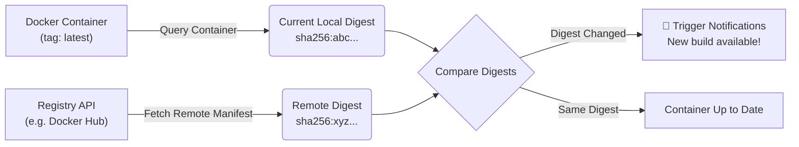

import Tabs from '@theme/Tabs';
import TabItem from '@theme/TabItem';

# Digest Watching & Rate Limits

This guide explains how WUD performs image digest analysis, why it affects registry rate limits (particularly on Docker Hub), and how to configure WUD to avoid rate limiting.

---

## 1. How Digest Watching Works

When a container runs an image with a mutable tag (such as `latest`, `nightly`, or `stable`), the tag name never changes even when a new version of the image is published to the registry.

To detect new builds for these tags, WUD inspects the **Image Digest** (the unique cryptographic SHA256 hash of the image manifest).




---

## 2. Docker Hub Rate Limits Explained

Fetching the remote image digest requires querying the _Docker Registry Manifest API_. 

:::warning[Docker Hub Pull Rate Limits]
Docker Hub treats manifest requests as **pull operations**, subjecting them to strict rate limits:
- **Anonymous Users**: 100 pulls per 6-hour window (tracked by client IP address).
- **Authenticated Free Users**: 200 pulls per 6-hour window.
- **Paid Pro/Team Users**: Unlimited pulls.

[Official Docker Hub Rate Limits Documentation](https://docs.docker.com/docker-hub/download-rate-limit/)
:::

If you run many containers or have frequent watcher check intervals, anonymous digest polling can quickly exhaust your 100 pull quota, resulting in `429 Too Many Requests` errors from Docker Hub.

---

## 3. Default WUD Digest Polling Rules

To protect you against accidental rate limits out of the box, WUD applies smart defaults:

| Image Tag Type | Example Tag | Default Digest Watching | Why? |
| :--- | :--- | :--- | :--- |
| **Semver Tags** | `v1.2.3`, `2.4.0` | **Disabled** by default | New versions are released under new tag numbers, which are discovered via lightweight tag list queries without consuming pull quota. |
| **Non-Semver Tags** | `latest`, `dev` | **Enabled** by default | The tag name doesn't change, so digest comparison is the only way to detect new builds. |

---

## 4. Best Practices to Prevent Rate Limiting

### Strategy 1: Authenticate with Docker Hub (Doubles Quota)
Configure the [Docker Hub Registry Module](../registries/hub/README.md) with your Docker Hub account and Personal Access Token (PAT). This raises your limit to 200 pulls/6h (or unlimited on paid accounts).

```yaml
environment:
  - WUD_REGISTRY_HUB_MYHUB_LOGIN=your-dockerhub-username
  - WUD_REGISTRY_HUB_MYHUB_PASSWORD=dckr_pat_your_token_here
```

---

### Strategy 2: Customize Digest Watching per Container
Use the `wud.watch.digest` container label to explicitly enable or disable digest polling for specific containers:

<Tabs>
<TabItem value="docker-compose" label="Docker Compose">

```yaml
services:
  my-app:
    image: my-app:latest
    labels:
      # Disable digest checking for this container to save API calls
      - "wud.watch.digest=false"

  critical-app:
    image: critical-app:1.4.0
    labels:
      # Force digest checking even on a semver tag
      - "wud.watch.digest=true"
```

</TabItem>
<TabItem value="docker" label="Docker">

```bash
docker run -d \
  --name my-app \
  -l "wud.watch.digest=false" \
  my-app:latest
```

</TabItem>
</Tabs>

---

### Strategy 3: Tune Watcher Schedule
Instead of scanning every few minutes, schedule watcher scans at sensible intervals using cron syntax:

```yaml
environment:
  # Check twice daily at 02:00 and 14:00
  - WUD_WATCHER_LOCAL_CRON=0 2,14 * * *
```

See [Container Labels](labels.md) for the complete list of per-container configuration labels.
