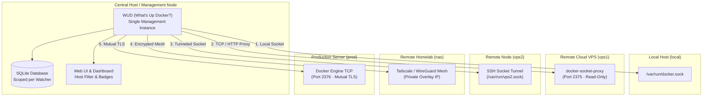
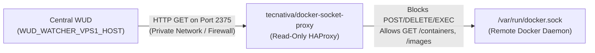
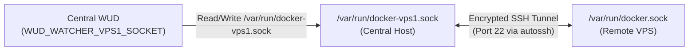
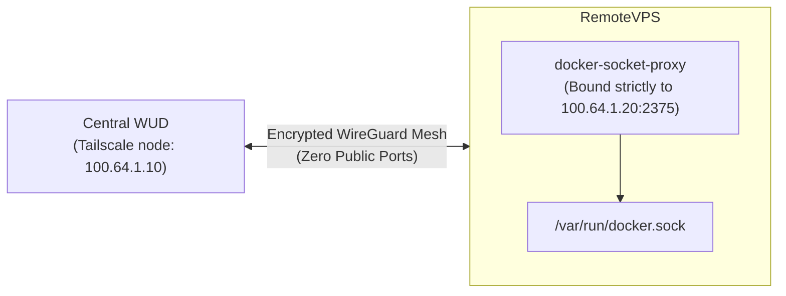
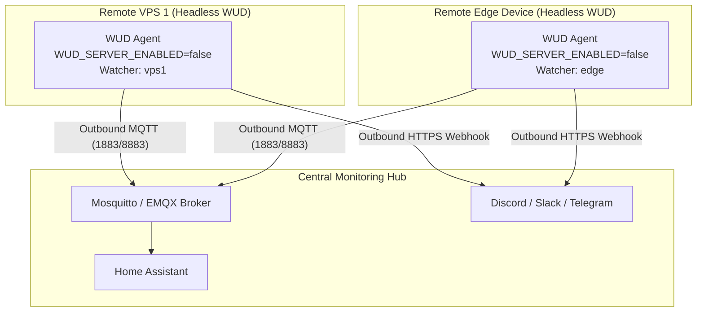

import DocHero from '@site/src/components/DocHero';
import Tabs from '@theme/Tabs';
import TabItem from '@theme/TabItem';

# Remote Daemons & Multi-Host Monitoring

<DocHero
  icon="docker"
  badge="Multi-Host & Remote"
  badgeType="info"
  description="Monitor multiple Docker engines from a single WUD instance across local machines, remote VPS instances, cloud nodes, and homelab servers."
/>

---

## 1. Multi-Host Architecture (1 Host = 1 Watcher)

WUD uses **Watchers** to connect to Docker daemons, discover running containers, inspect their image tags, and query registries for updates.

The core principle for multi-host monitoring in WUD is simple:

> **1 Host = 1 Watcher** (`WUD_WATCHER_<NAME>_*`)

To monitor multiple Docker daemons from a single WUD instance, define a separate watcher configuration block for each target host. Each watcher has an identifier (`<NAME>`), its own connection settings, independent polling schedule, jitter, and real-time event listener.



---

## 2. How WUD Differentiates Containers Across Hosts

When monitoring dozens of containers across multiple servers, clear organization and fault isolation are essential. WUD handles multi-host environments natively across all components:

### 🖥️ Web UI & Topbar Filtering

- **Host Badges**: Every container card in the Grid view and every row in the Table view displays a dedicated badge with its watcher name (for example, `local`, `vps1`, `nas`).
- **Watcher Filter**: The top navigation bar includes an interactive Watcher filter dropdown. You can switch between viewing all containers across your fleet or isolating containers on a specific host with a single click.
- **Search Integration**: The search bar instantly filters containers by name, image, or watcher host.

### 🗄️ Database Isolation & Fault Tolerance

- **Partitioned Persistence**: All container states, image digests, and update statuses are stored in SQLite and partitioned by the `watcher` identifier.
- **Independent Pruning**: Container inventory synchronization is strictly scoped per watcher. If containers are stopped or removed on `vps1`, only `vps1` container records are pruned.
- **Network Resilience**: If a remote host temporarily loses internet connectivity or reboots, WUD logs the connection timeout for that watcher. The container records from healthy hosts (`local`, `nas`) remain completely unaffected, preventing false alerts or data loss.

### 🔔 Notification Context & Templating

All notification triggers (including Discord, Slack, Telegram, Webhooks, Apprise, Matrix, and Email) expose the watcher name in the templating context:

- In Simple mode, access the host name via `${container.watcher}`.
- In Batch mode, group updates by host or display the affected host next to each container name.
- Example notification template:

```text
[${container.watcher}] Container ${container.name} can be updated to ${container.updateKind.remoteValue}
```

### 🏠 Home Assistant MQTT Topology

When using the [Home Assistant MQTT trigger](../triggers/homeassistant-mqtt/README.md) with auto-discovery enabled:

- **Per-Watcher Devices**: WUD automatically registers a separate Home Assistant **Device** for each watcher (such as `WUD (local)` and `WUD (vps1)`).
- **Dedicated Entities**: All Update entities (`update.wud_vps1_nginx`), status sensors, and one-click install controls are grouped directly under their corresponding host device in the Home Assistant UI.
- **No Entity Collisions**: Containers sharing the same name on different hosts (such as `nginx` on `local` and `nginx` on `vps1`) produce distinct entities (`update.wud_local_nginx` and `update.wud_vps1_nginx`).

---

## 3. Remote Host Connection Strategies

WUD supports two connection primitives per watcher:

| Mode | Parameters | Description |
| :--- | :--- | :--- |
| **UNIX Socket** | `WUD_WATCHER_<NAME>_SOCKET` | Connects to a local UNIX domain socket file path. |
| **TCP Host & Port** | `WUD_WATCHER_<NAME>_HOST` + `WUD_WATCHER_<NAME>_PORT` | Connects to a remote Docker API daemon over TCP. |

:::warning[Mutually Exclusive]
`SOCKET` and `HOST`/`PORT` are mutually exclusive for a single watcher. If `HOST` is specified, `SOCKET` is ignored for that watcher.
:::

Connecting to remote Docker daemons over raw, unencrypted TCP (`port 2375`) exposes root-equivalent control over the remote system. **Never expose port 2375 directly to the public internet.**

Choose one of the four battle-tested strategies below depending on your network architecture:

| Strategy | Security Level | Best Suited For | Exposed Public Ports |
| :--- | :--- | :--- | :--- |
| **1. Read-Only Socket Proxy** | High | Private LAN, VPC, or paired with VPN | Single TCP port (Read-only APIs) |
| **2. SSH Socket Tunnel** | Maximum | Public VPS / Remote cloud instances | None (uses existing SSH port 22) |
| **3. Private Mesh Network** | Maximum | Multi-cloud, hybrid homelab, dynamic IPs | None (encrypted WireGuard overlay) |
| **4. Mutual TLS (mTLS)** | High | Direct public IP daemon connection | Port 2376 (Client certificate required) |

---

### Strategy 1: Read-Only Docker Socket Proxy (Recommended)

The most popular and straightforward method to monitor remote Docker engines securely is placing a read-only reverse proxy between WUD and the remote Docker socket.

The audited [`tecnativa/docker-socket-proxy`](https://github.com/Tecnativa/docker-socket-proxy) image uses HAProxy to filter incoming Docker API calls. By allowing only the `GET` endpoints that WUD requires (`GET /containers`, `GET /images`, `GET /info`) and denying all mutating methods (`POST=0`, `DELETE=0`, `BUILD=0`, `EXEC=0`), the proxy prevents any container creation, modification, or host takeover.



#### Step 1: Deploy Socket Proxy on Remote Host

On the remote host you want to monitor, create a `docker-compose.yml` file:

```yaml
services:
  docker-socket-proxy:
    image: tecnativa/docker-socket-proxy:latest
    container_name: docker-socket-proxy
    restart: unless-stopped
    ports:
      # Bind to internal LAN/VPC IP or firewall port 2375 to allow only Central WUD
      - "2375:2375"
    volumes:
      - /var/run/docker.sock:/var/run/docker.sock:ro
    environment:
      # Enable read-only access for container and image discovery
      - CONTAINERS=1
      - IMAGES=1
      - INFO=1
      - VERSION=1
      - EVENTS=1
      - PING=1
      # Explicitly deny all mutating operations
      - POST=0
      - DELETE=0
      - BUILD=0
      - COMMIT=0
      - EXEC=0
      - SECRETS=0
      - SWARM=0
      - SYSTEM=0
```

Start the proxy:

```bash
docker compose up -d
```

:::tip[Firewall Protection]
Ensure your remote host's firewall (such as `ufw`, `nftables`, or cloud security group) allows inbound traffic on port `2375` **only** from the IP address of your central WUD host.
:::

#### Step 2: Configure Central WUD

On your central machine running WUD, add the remote watcher to `docker-compose.yml`:

```yaml
services:
  whatsupdocker:
    image: getwud/wud:latest
    container_name: wud
    restart: unless-stopped
    ports:
      - "3000:3000"
    volumes:
      - /var/run/docker.sock:/var/run/docker.sock:ro
      - wud-data:/var/lib/wud
    environment:
      # Local host watcher
      - WUD_WATCHER_LOCAL_SOCKET=/var/run/docker.sock

      # Remote host watcher (via read-only proxy)
      - WUD_WATCHER_VPS1_HOST=vps1.internal.example.com
      - WUD_WATCHER_VPS1_PORT=2375
      - WUD_WATCHER_VPS1_CRON=0 * * * *
      - WUD_WATCHER_VPS1_WATCHEVENTS=true

volumes:
  wud-data:
```

---

### Strategy 2: SSH Socket Tunneling (`ssh -L`)

If your remote host has a public IP and you do not want to open any additional TCP ports in firewalls or security groups, you can forward the remote Docker socket through an encrypted SSH tunnel.

This maps the remote `/var/run/docker.sock` to a local Unix domain socket on the central host (such as `/var/run/docker-vps1.sock`). WUD connects to the local socket file as if it were a local daemon.



#### Step 1: Create SSH Forwarding Tunnel

Using standard OpenSSH client forwarding (`-L`), connect the remote socket to a local path:

```bash
ssh -nNT -L /var/run/docker-vps1.sock:/var/run/docker.sock user@remote-vps.example.com
```

For a persistent, self-healing background connection in production, you can use `autossh` via a systemd unit or a lightweight sidecar container in Docker Compose:

<Tabs>
<TabItem value="compose-sidecar" label="Docker Compose (Sidecar Tunnel)">

```yaml
services:
  ssh-tunnel-vps1:
    image: alpine/socat:latest
    container_name: ssh-tunnel-vps1
    restart: unless-stopped
    volumes:
      - /root/.ssh/id_ed25519:/root/.ssh/id_ed25519:ro
      - vps1-socket:/var/run/sockets
    entrypoint: >
      sh -c "
        apk add --no-cache openssh-client autossh &&
        autossh -M 0 -o 'ServerAliveInterval=30' -o 'ServerAliveCountMax=3' \
          -o 'StrictHostKeyChecking=accept-new' -N -T \
          -L /var/run/sockets/docker-vps1.sock:/var/run/docker.sock \
          user@remote-vps.example.com
      "

  whatsupdocker:
    image: getwud/wud:latest
    container_name: wud
    restart: unless-stopped
    depends_on:
      - ssh-tunnel-vps1
    ports:
      - "3000:3000"
    volumes:
      - /var/run/docker.sock:/var/run/docker.sock:ro
      - vps1-socket:/var/run/remote-sockets:ro
      - wud-data:/var/lib/wud
    environment:
      # Local Docker host
      - WUD_WATCHER_LOCAL_SOCKET=/var/run/docker.sock

      # Remote Docker host (via SSH socket tunnel)
      - WUD_WATCHER_VPS1_SOCKET=/var/run/remote-sockets/docker-vps1.sock
      - WUD_WATCHER_VPS1_CRON=0 * * * *

volumes:
  vps1-socket:
  wud-data:
```

</TabItem>
<TabItem value="systemd" label="Host Systemd Service">

Create `/etc/systemd/system/autossh-vps1-docker.service` on the central host:

```ini
[Unit]
Description=AutoSSH Tunnel for Remote Docker Socket
After=network.target

[Service]
User=root
ExecStart=/usr/bin/autossh -M 0 -N -q -o "ServerAliveInterval=30" -o "ServerAliveCountMax=3" -o "ExitOnForwardFailure=yes" -L /var/run/docker-vps1.sock:/var/run/docker.sock user@remote-vps.example.com
Restart=always
RestartSec=10

[Install]
WantedBy=multi-user.target
```

Enable and start the service:

```bash
sudo systemctl daemon-reload
sudo systemctl enable --now autossh-vps1-docker
```

Then mount `/var/run/docker-vps1.sock` into your central WUD container and configure `WUD_WATCHER_VPS1_SOCKET=/var/run/docker-vps1.sock`.

</TabItem>
</Tabs>

---

### Strategy 3: Private Mesh Networks (Tailscale / WireGuard)

If your servers are distributed across cloud providers, residential connections behind NAT, or home servers without static public IPs, a private mesh overlay network such as [Tailscale](https://tailscale.com/) or [WireGuard](https://www.wireguard.com/) is ideal.

In a mesh network, all nodes join a secure, encrypted peer-to-peer overlay network with private IP addresses (for example, `100.64.0.0/10` in a Tailscale tailnet). No ports are exposed to the public internet.



#### Best Practice: Mesh + Read-Only Proxy

Combine the mesh network with `tecnativa/docker-socket-proxy` bound **strictly** to the node's Tailscale or WireGuard VPN IP address:

<Tabs>
<TabItem value="remote-node" label="Remote Node Compose">

```yaml
services:
  docker-socket-proxy:
    image: tecnativa/docker-socket-proxy:latest
    container_name: docker-socket-proxy
    restart: unless-stopped
    ports:
      # Bind explicitly to the node's Tailscale IP (e.g. 100.64.1.20)
      - "100.64.1.20:2375:2375"
    volumes:
      - /var/run/docker.sock:/var/run/docker.sock:ro
    environment:
      - CONTAINERS=1
      - IMAGES=1
      - INFO=1
      - VERSION=1
      - EVENTS=1
      - POST=0
      - DELETE=0
```

</TabItem>
<TabItem value="central-wud" label="Central WUD Compose">

```yaml
services:
  whatsupdocker:
    image: getwud/wud:latest
    container_name: wud
    restart: unless-stopped
    volumes:
      - /var/run/docker.sock:/var/run/docker.sock:ro
      - wud-data:/var/lib/wud
    environment:
      - WUD_WATCHER_LOCAL_SOCKET=/var/run/docker.sock

      # Point to remote Tailscale IP or MagicDNS hostname
      - WUD_WATCHER_OFFSITE_HOST=100.64.1.20
      - WUD_WATCHER_OFFSITE_PORT=2375
      - WUD_WATCHER_OFFSITE_CRON=0 * * * *

volumes:
  wud-data:
```

</TabItem>
</Tabs>

---

### Strategy 4: Mutual TLS (mTLS on Port 2376)

When exposing the Docker daemon TCP port directly across networks without an intermediary VPN or proxy, you **must** secure it with mutual TLS (mTLS) authentication.

In this mode, Docker listens on port `2376`. Both the server and the client (WUD) authenticate each other using x509 certificates signed by a shared Certificate Authority (CA). Unauthenticated requests or clients with invalid certificates are rejected at the TLS handshake.

#### Required TLS Certificates

To authenticate against a TLS-secured Docker daemon, provide the following 3 files to WUD:

| Variable | Description | Example Path in Container |
| :--- | :--- | :--- |
| `WUD_WATCHER_<NAME>_CAFILE` | Certificate Authority certificate PEM | `/certs/prod/ca.pem` |
| `WUD_WATCHER_<NAME>_CERTFILE` | Client public certificate PEM | `/certs/prod/cert.pem` |
| `WUD_WATCHER_<NAME>_KEYFILE` | Client private key PEM | `/certs/prod/key.pem` |

#### Step 1: Configure Remote Docker Daemon for mTLS

On the remote host, ensure `/etc/docker/daemon.json` contains:

```json
{
  "tls": true,
  "tlscacert": "/etc/docker/certs/ca.pem",
  "tlscert": "/etc/docker/certs/server-cert.pem",
  "tlskey": "/etc/docker/certs/server-key.pem",
  "tlsverify": true,
  "hosts": ["unix:///var/run/docker.sock", "tcp://0.0.0.0:2376"]
}
```

Restart the Docker daemon on the remote host:

```bash
sudo systemctl restart docker
```

#### Step 2: Configure Central WUD with Certificates

Mount your client certificates into the WUD container as read-only volumes and reference them in environment variables:

<Tabs>
<TabItem value="docker-compose" label="Docker Compose">

```yaml
services:
  whatsupdocker:
    image: getwud/wud:latest
    container_name: wud
    restart: unless-stopped
    volumes:
      - /var/run/docker.sock:/var/run/docker.sock:ro
      - /opt/wud/certs/prod-node:/certs/prod-node:ro
      - wud-data:/var/lib/wud
    environment:
      # Local Docker host
      - WUD_WATCHER_LOCAL_SOCKET=/var/run/docker.sock

      # Remote Docker host (mTLS authenticated)
      - WUD_WATCHER_PROD_HOST=prod.example.com
      - WUD_WATCHER_PROD_PORT=2376
      - WUD_WATCHER_PROD_CAFILE=/certs/prod-node/ca.pem
      - WUD_WATCHER_PROD_CERTFILE=/certs/prod-node/cert.pem
      - WUD_WATCHER_PROD_KEYFILE=/certs/prod-node/key.pem
      - WUD_WATCHER_PROD_CRON=0 2 * * *

volumes:
  wud-data:
```

</TabItem>
<TabItem value="docker" label="Docker Run">

```bash
docker run -d \
  --name whatsupdocker \
  -v /var/run/docker.sock:/var/run/docker.sock:ro \
  -v /opt/wud/certs/prod-node:/certs/prod-node:ro \
  -e WUD_WATCHER_LOCAL_SOCKET=/var/run/docker.sock \
  -e WUD_WATCHER_PROD_HOST=prod.example.com \
  -e WUD_WATCHER_PROD_PORT=2376 \
  -e WUD_WATCHER_PROD_CAFILE=/certs/prod-node/ca.pem \
  -e WUD_WATCHER_PROD_CERTFILE=/certs/prod-node/cert.pem \
  -e WUD_WATCHER_PROD_KEYFILE=/certs/prod-node/key.pem \
  -e WUD_WATCHER_PROD_CRON="0 2 * * *" \
  getwud/wud:latest
```

</TabItem>
</Tabs>

---

## 4. Bonus Pattern: Decentralized Headless WUD + Central MQTT Hub

In edge locations, firewalled subnets, or air-gapped homelabs where inbound connections to remote nodes are completely blocked, central polling may not be practical.

Instead of running one central WUD instance reaching out to remote nodes, you can invert the architecture:

1. Run a lightweight **Headless WUD Agent** on each remote node.
2. Disable the Web UI and HTTP server with `WUD_SERVER_ENABLED=false`.
3. The remote WUD agent monitors its local `/var/run/docker.sock` and pushes update events **outbound** to a central message bus or notification channel:
   - Central [MQTT Broker](../triggers/mqtt/README.md) (with [Home Assistant MQTT](../triggers/homeassistant-mqtt/README.md) discovery enabled)
   - Central [Webhook](../triggers/http/README.md) or Webhook receiver
   - Central messaging platforms ([Discord](../triggers/discord/README.md), [Slack](../triggers/slack/README.md), [Ntfy](../triggers/ntfy/README.md), [Gotify](../triggers/gotify/README.md), [Telegram](../triggers/telegram/README.md))



### Headless Remote Agent Recipe

Deploy this minimal `docker-compose.yml` on any remote server. It consumes minimal RAM and CPU, opens no inbound ports, and connects outbound to your central MQTT broker:

```yaml
services:
  wud-agent:
    image: getwud/wud:latest
    container_name: wud-agent
    restart: unless-stopped
    volumes:
      - /var/run/docker.sock:/var/run/docker.sock:ro
      - wud-agent-data:/var/lib/wud
    environment:
      # Disable HTTP server and web dashboard
      - WUD_SERVER_ENABLED=false

      # Monitor local docker socket under a unique watcher name
      - WUD_WATCHER_VPS1_SOCKET=/var/run/docker.sock
      - WUD_WATCHER_VPS1_CRON=0 */2 * * *

      # Push outbound notifications to central MQTT (with Home Assistant discovery)
      - WUD_TRIGGER_MQTT_CENTRAL_URL=mqtts://mqtt.example.com:8883
      - WUD_TRIGGER_MQTT_CENTRAL_USER=vps1_client
      - WUD_TRIGGER_MQTT_CENTRAL_PASSWORD=SecretPassword123
      - WUD_TRIGGER_MQTT_CENTRAL_HASS_ENABLED=true
      - WUD_TRIGGER_MQTT_CENTRAL_HASS_DISCOVERY=true

      # Optional: Send push alerts directly to your Discord/Telegram channel
      - WUD_TRIGGER_DISCORD_ALERTS_URL=https://discord.com/api/webhooks/123/xyz
      - WUD_TRIGGER_DISCORD_ALERTS_SIMPLEBODY=[vps1] Container ${container.name} has update ${container.updateKind.remoteValue}

volumes:
  wud-agent-data:
```

---

## 5. Full Production Multi-Host Example

Here is a complete, production-ready `docker-compose.yml` showcasing a central WUD dashboard monitoring:

1. **`local`**: Local Docker socket (`/var/run/docker.sock`).
2. **`proxy_node`**: Remote server via `tecnativa/docker-socket-proxy`.
3. **`tunneled_node`**: Remote server via SSH tunneled socket.
4. **`mesh_node`**: Remote server via Tailscale / WireGuard mesh IP.
5. **`prod_node`**: Remote server via Mutual TLS (`port 2376`).
6. Centralized Discord notifications showing the host name for all updates.

```yaml
services:
  whatsupdocker:
    image: getwud/wud:latest
    container_name: wud
    restart: unless-stopped
    ports:
      - "3000:3000"
    volumes:
      # Local socket
      - /var/run/docker.sock:/var/run/docker.sock:ro
      # SSH tunneled socket from sidecar or autossh
      - /var/run/remote-sockets:/var/run/remote-sockets:ro
      # TLS certificates for production node
      - /opt/wud/certs/prod-node:/certs/prod-node:ro
      # Persistent SQLite database
      - wud-data:/var/lib/wud
    environment:
      # General Configuration
      - WUD_LOG_LEVEL=info

      # Host 1: Local Docker Engine
      - WUD_WATCHER_LOCAL_SOCKET=/var/run/docker.sock
      - WUD_WATCHER_LOCAL_WATCHEVENTS=true

      # Host 2: Remote VPS via Read-Only Docker Socket Proxy
      - WUD_WATCHER_PROXY_NODE_HOST=192.168.10.50
      - WUD_WATCHER_PROXY_NODE_PORT=2375
      - WUD_WATCHER_PROXY_NODE_CRON=0 * * * *

      # Host 3: Remote Cloud Instance via SSH Socket Tunnel
      - WUD_WATCHER_TUNNELED_NODE_SOCKET=/var/run/remote-sockets/docker-vps2.sock
      - WUD_WATCHER_TUNNELED_NODE_CRON=0 * * * *

      # Host 4: Remote Homelab via Tailscale Mesh Network
      - WUD_WATCHER_MESH_NODE_HOST=100.64.1.25
      - WUD_WATCHER_MESH_NODE_PORT=2375
      - WUD_WATCHER_MESH_NODE_CRON=0 */2 * * *

      # Host 5: Production Node via Mutual TLS
      - WUD_WATCHER_PROD_NODE_HOST=prod.example.com
      - WUD_WATCHER_PROD_NODE_PORT=2376
      - WUD_WATCHER_PROD_NODE_CAFILE=/certs/prod-node/ca.pem
      - WUD_WATCHER_PROD_NODE_CERTFILE=/certs/prod-node/cert.pem
      - WUD_WATCHER_PROD_NODE_KEYFILE=/certs/prod-node/key.pem
      - WUD_WATCHER_PROD_NODE_CRON=0 3 * * *

      # Global Notification with Host Identification
      - WUD_TRIGGER_DISCORD_GLOBAL_URL=https://discord.com/api/webhooks/123/xyz
      - WUD_TRIGGER_DISCORD_GLOBAL_THRESHOLD=all
      - WUD_TRIGGER_DISCORD_GLOBAL_SIMPLEBODY=[${container.watcher}] Container ${container.name} (${container.image.tag.value}) can be updated to ${container.updateKind.remoteValue}

volumes:
  wud-data:
```
